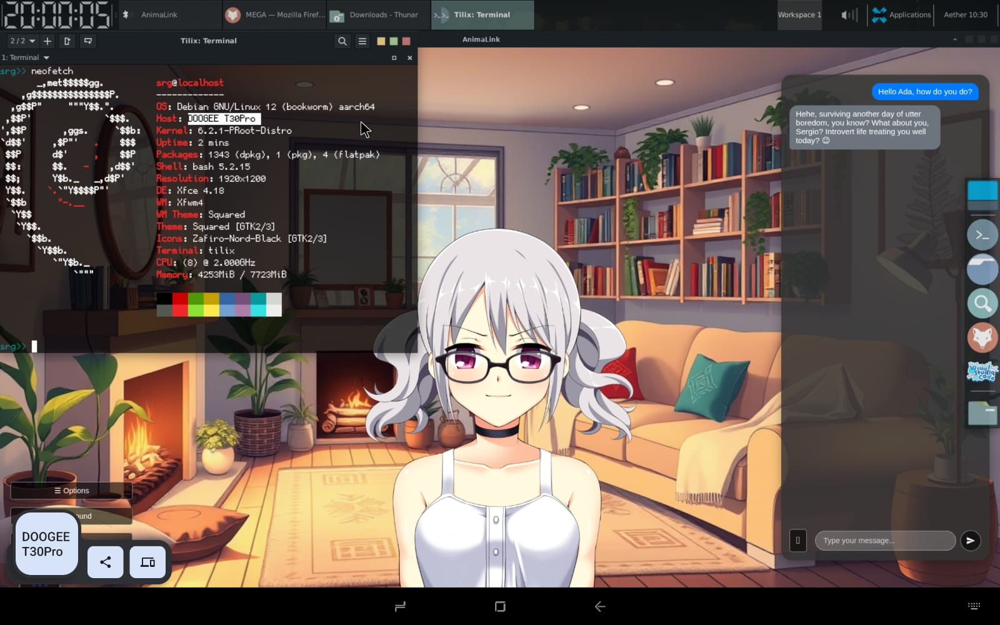
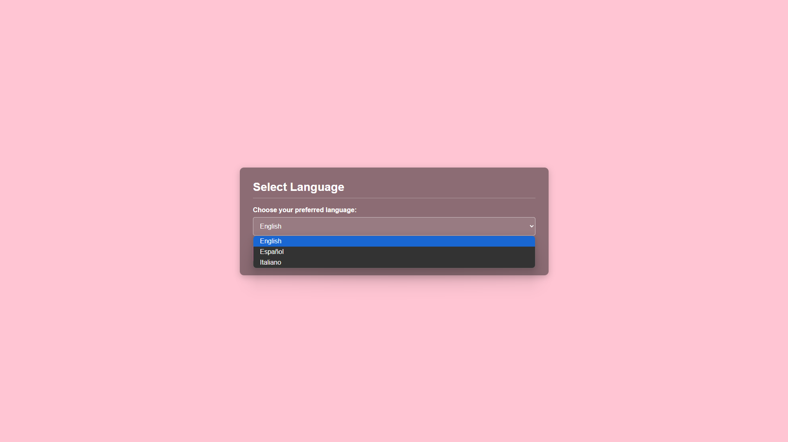
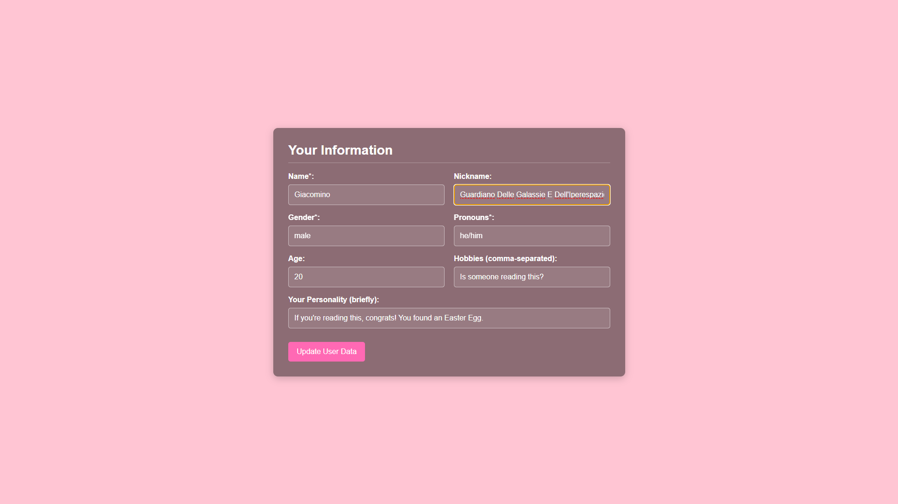
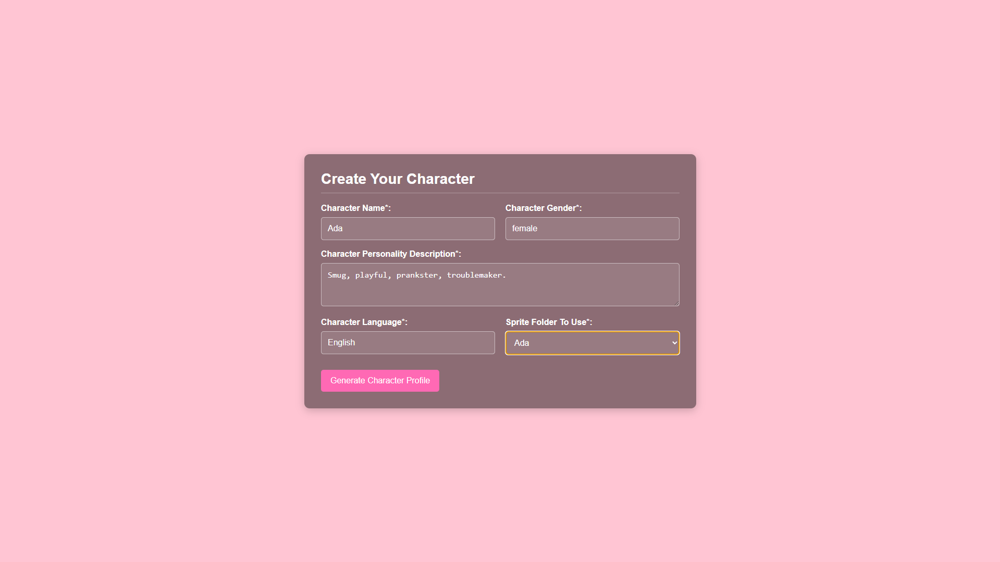

# **AnimaLink**

## **So... What is AnimLink?**
AnimaLink is an interactive desktop experience where you can create and connect with unique AI-powered characters that live in a visual novel-like world. Each character is deeply personalized, shaped by your input, and capable of forming long-lasting bonds through natural conversation and emotional memory.

These companions aren't just passive chatbots — they grow alongside you. Every interaction helps them learn more about you, and they reflect on your shared moments through in-character diary entries that act as their long-term memory.

AnimaLink also includes interactive features that bring your characters to life. You can perform actions like hugging, head-patting, or even tickling them with a click of a button — and they’ll react accordingly based on their personality. They also respond dynamically when you change the background of their world or open their diary, making them feel truly present.

Whether you're looking for a friend, a confidant, or just a gentle presence on your desktop, AnimaLink offers a comforting space where your AI companion is always glad to see you.


## **✨ Features**

AnimaLink isn't just a chat app — it's a rich, personal experience that blends interactive storytelling with AI companionship. Here’s what makes it special:

---

### 🧠 Responsive AI Companion

Your character will react naturally to your messages, adapting to your interactions and staying true to their personality — as long as their sprite set includes enough expression images.

---

### 👁️ Vision Support *(If Model Allows)*

If your LLM supports vision, you can send images (like memes, selfies, or photos) and your character will interpret and respond to them accordingly.

---

### 📓 Memory & Diary System

Characters don’t just remember the last few messages — they keep track of important details about you through diary entries that evolve over time. This creates a persistent, growing bond.

---

### 🤝 Interactive Actions

Through the **Perform** button, you can engage your character in fun interactions:

* Tickle
* Kiss
* Pet head
* Hold hand
* High five
* Massage

> Characters will respond to these interactions, depending on their personality and mood.

---

### 🌆 Environmental Awareness

Characters react when you:

* Open their diary **(they may not like it!)**
* Change the background — and if vision is enabled, they’ll actually *see* it.

---

### 🛠️ Easy Modding

Create your own characters, backgrounds, music, or sprites with ease:

* Use the **Open Modding Folder** option in the settings to access game files.
* Drop your assets into the relevant folders and you're done!

---

### 💾 Automatic & Manual Backups

The game creates automatic backups, and you can manually make one at any time via the **Create Backup** button. Easily safeguard or restore your character's memories and relationship history.

---

### 📦 Character Export System

Want to share your character without sharing personal conversations? Use the **Create Base Backup** option to generate a clean version of the character — no diary or memory data included. Just add the backup and the sprites into a  .zip file and you're ready to share!

## **Compatibility**

**AnimaLink** is currently available for the following platforms, click to follow the download link:

* [🪟 **Windows (x64)**](INSERT-WINDOWS-LINK-HERE) (Currently the links take you nowhere, I'll add the actual links soon)
* [🐧 **Linux (x64)**](INSERT-LINUX-X64-LINK-HERE)
* [📱 **Linux (arm64)**](INSERT-ARM64-DEBIAN-LINK-HERE)

Stay tuned for more platforms and updates in the future!

  > *Note: The arm64 version is only available for Debian-based distributions via `.deb` package.*

We're planning to support **macOS** in the future. A macOS build may be added once compatibility testing is completed.

---

### 💻 Build from Source

If you'd like to run or compile AnimaLink yourself, you can do so easily by following these steps:

1. Make sure you have [the latest versions of **Node.js**, **npm**, and **nvm** installed](https://nodejs.org/en/download).
2. Clone this repository:

   ```
   git clone https://github.com/srg2912/AnimaLink.git
   ```
3. Navigate into the project directory and install dependencies:

   ```
   cd AnimaLink
   npm i
   ```
4. To run the app without compiling:

   ```
   npm run electron:start
   ```
5. To compile a standalone executable:

   ```
   npm run dist -- --[OS: win, mac, or linux] [optional: architecture]
   ```

---

### 📱 Android Compatibility (Advanced Users Only)

AnimaLink does **not** have a native Android version, and one is unlikely to be released due to Electron’s limitations — particularly around backend functionality and packaging constraints on mobile platforms.

However, **advanced users** can technically run the Linux arm64 version on Android using a workaround. This method is **not recommended for inexperienced users**.

To try it anyway, you’ll need:

1. **Termux** (from F-Droid or a trusted source)
2. A **VNC server** to provide a graphical interface
3. A **Debian-based distro** installed in Termux
4. The **Linux arm64 `.deb` package** of AnimaLink

Once your environment is ready:

```bash
# Inside your Debian terminal:
cd ~/Downloads
sudo dpkg --install animalink.deb
animalink --no-sandbox
```

> ⚠️ For the best experience, use a **tablet** with a **physical keyboard**. On-screen keyboards will likely cover the interface and make the app difficult to use. The experience **isn't as smooth** compared to desktop.



## **How to play the game?**
After downloading and installing the game, you'll have to complete the next steps. (Only for the first time you enter the app, then you can modify any of them in the options menu)

**Remember that you can togle between Full screen and Windowed mode with the F11 key.**

1. **Select your language:** Currently only English, Spanish and Italian are supported as the interface language. This is independent from the character's language, which can be set to any one you like as long as the model itself is abe to understand it.



2. **Set your API:** **Only OpenAI APIs compatible**, this doesn't mean that only OpenAI models are compatible, but it means that the API you set must be compatible with the OpenAI library. In this example I'm using Gemini 2.0 Flash from Google, but I'm using its OpenAI endpoint. To properly set the API:
    - Insert the model's name
    - Insert your API key
    - Insert an OpenAI compatible endpoint (URL)

    **A detailed guide on how to get your own API key can be found in the next section.**


3. **Set your information:** Set your own information, this info will be given to the AI for a better experience. **Remember that we don't collect this data in any way but the LLM Provider might do, so we recommend not to share any sensible data just in case.**



4. **Restore or create new character:** Choose between restore a character (if you have the proper backup in the backups file and the proper sprites fo that character) or to create a new one.


    
5. **Restore a character:** This is thow the screen changes if you choose to restore a character, in my case I didn't have one to restore yet.


6. **Create your character:** In this section you have to fill of the data requested in order to create a new character, fill it however you want!



7. **Modify character profile:** Once you've clicked in 'Generate Character Profile' a detailed profile for your character will be created, this will be their **personality**. Feel free to modify it as much as you want! Or to rewrite it from scratch entirely!


8. **Play it:** You're finally ready to chat with your character!


## **🛠️ Troubleshooting – Common Problems**

If you run into issues while using AnimaLink, here are some common problems and how to fix them:

### 1. `ERR_UNSAFE_PORT` (Mostly on Linux)

This error may appear if the global `PORT` environment variable is set to a port considered unsafe by your OS.

**Solution:**

* On Linux:

  ```bash
  PORT=3000 animalink
  ```
* On Termux:

  ```bash
  PORT=3000 animalink --no-sandbox
  ```

### 2. Character Sprite Doesn’t Load on Creation

This usually happens when using **custom sprites** and the sprite folder doesn’t include a `normal.png` pose.

**Solution:**

* Either send the first message to the character and the issue may fix itself,
* Or manually add a `normal.png` image to the character’s sprite folder.

### 3. Can't Type or Send Messages After an Event

Sometimes after certain actions, the input box may become unresponsive.

**Solution:**

- Close and reopen the app. This issue was more common in previous versions and may already be fixed.

### 4. 500 Error When Sending Messages or Interacting

A 500 error usually indicates a problem between AnimaLink and the Language Model (LLM).

**Checklist:**

* ✅ Make sure you're connected to the internet
* ✅ Double-check that your API key is properly set
* ✅ If you were just chatting moments ago and it suddenly stops working, you may have **reached your daily quota**. Wait until it resets or use a different API key.

## **⚙️ Technologies used**

I've used vanilla **HTML**, **CSS** and **JavaScript** for the frontend, **Node** and **Express.js** for the backend. I've used **Electron** to build the desktop application, since the first versions ran on a web browser by going to localhost:3000; then I used **Electron Builder** to package the app.

 Since Electron Builder only builds apps for the current OS being used and I mainly use **Windows**, I used a **virtual machine** to run **Linux** and package the app. I've also used **Termux** on **Android** to test the arm64 version myself. 
 
 Lastly, I should say that I've used the **OpenAI library** to manage the LLM requests, so this app is only compatible with APIs that have an OpenAI compatible endpoint.

## **🐈 Who are MechaNeko Studios?**

At the current time of writing this README **it's just me**, Sergio A., I just wanted to use some sort of pen name to publish this game. But I'm not against the idea of expanding the team if the opportunity ever appears.

## **✨ Special Thanks**

### Default Sprites
- Thanks to [Sutemo](https://sutemo.itch.io) for the default sprites that were used on this game.

### Music
- Perfect Beauty track by [Zakhar Valaha](https://pixabay.com/users/good_b_music-22836301/?utm_source=link-attribution&utm_medium=referral&utm_campaign=music&utm_content=191271) from [Pixabay](https://pixabay.com//?utm_source=link-attribution&utm_medium=referral&utm_campaign=music&utm_content=191271)
- Summer Walk track by [folk\_acoustic](https://pixabay.com/users/folk_acoustic-25300778/?utm_source=link-attribution&utm_medium=referral&utm_campaign=music&utm_content=152722) from [Pixabay](https://pixabay.com/music//?utm_source=link-attribution&utm_medium=referral&utm_campaign=music&utm_content=152722)
- Smooth Waters track by [Sergii Pavkin](https://pixabay.com/users/sergepavkinmusic-6130722/?utm_source=link-attribution&utm_medium=referral&utm_campaign=music&utm_content=115977) from [Pixabay](https://pixabay.com/music//?utm_source=link-attribution&utm_medium=referral&utm_campaign=music&utm_content=115977)
- Simple Piano Melody track by [Zakhar Valaha](https://pixabay.com/users/good_b_music-22836301/?utm_source=link-attribution&utm_medium=referral&utm_campaign=music&utm_content=9834) from [Pixabay](https://pixabay.com/music//?utm_source=link-attribution&utm_medium=referral&utm_campaign=music&utm_content=9834)
- Relaxing Ambient music | S Memories track by [Clavier Clavier](https://pixabay.com/users/clavier-music-16027823/?utm_source=link-attribution&utm_medium=referral&utm_campaign=music&utm_content=345087) from [Pixabay](https://pixabay.com//?utm_source=link-attribution&utm_medium=referral&utm_campaign=music&utm_content=345087)
- Relaxing Ambient music | Nostalgic Memories track by [Clavier Clavier](https://pixabay.com/users/clavier-music-16027823/?utm_source=link-attribution&utm_medium=referral&utm_campaign=music&utm_content=345088) from [Pixabay](https://pixabay.com//?utm_source=link-attribution&utm_medium=referral&utm_campaign=music&utm_content=345088)
- soft piano music track by [Clavier Clavier](https://pixabay.com/users/clavier-music-16027823/?utm_source=link-attribution&utm_medium=referral&utm_campaign=music&utm_content=312509) from [Pixabay](https://pixabay.com/music//?utm_source=link-attribution&utm_medium=referral&utm_campaign=music&utm_content=312509)

### Testing
- My sister Claudia for being the Beta Tester, thanks to her the Linux arm64 version exist, otherwise I'd have given up on it since it gave me so much trouble.

### The Player
Thank **YOU** for trying out this game.