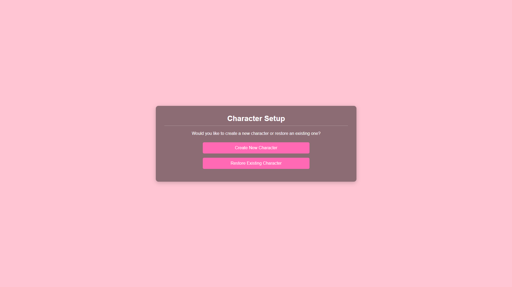
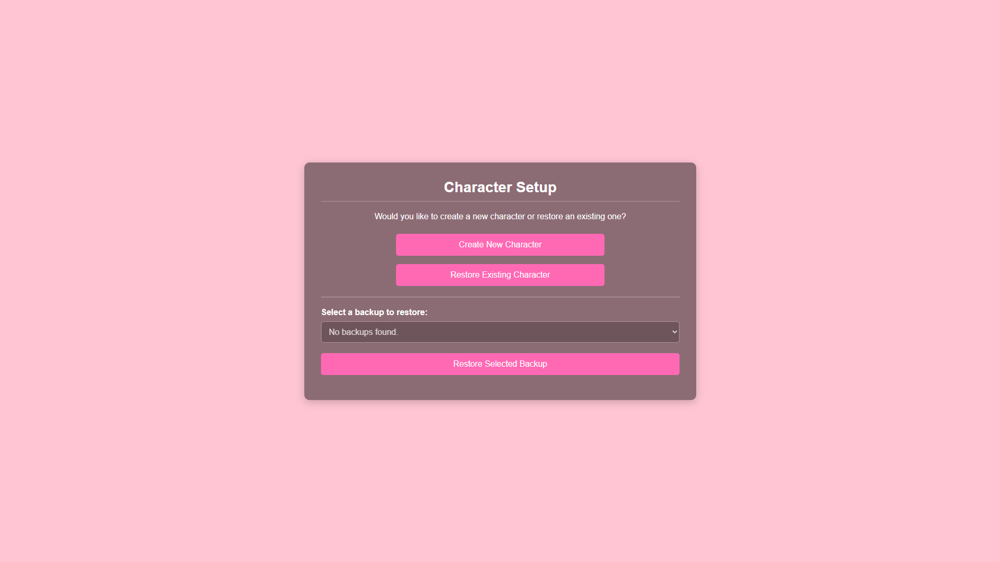
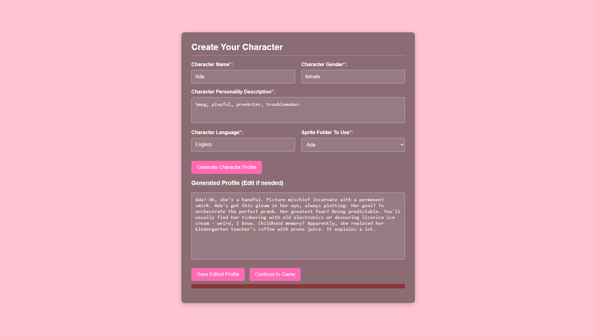
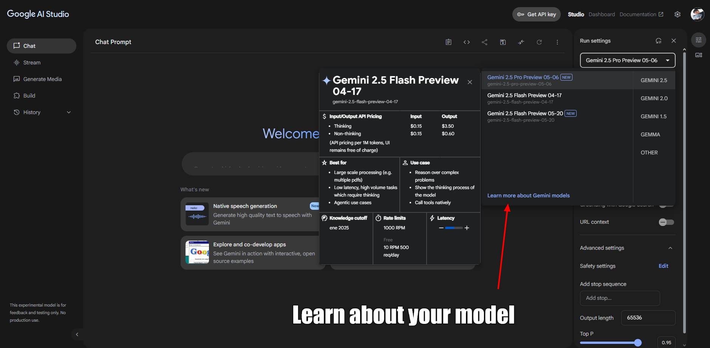

# **AnimaLink**
**🌐 Language: [English](README.md) | [Español](README.es.md) | [Italiano](README.it.md)**
**🔗 Join our [Discord](https://discord.gg/hXeYb8up)**

## Table of Contents
- [**AnimaLink**](#animalink)
  - [Table of Contents](#table-of-contents)
  - [**So... What is AnimaLink?**](#so-what-is-animalink)
  - [**✨ Features**](#-features)
    - [🧠 Responsive AI Companion](#-responsive-ai-companion)
    - [👁️ Vision Support *(If Model Allows)*](#️-vision-support-if-model-allows)
    - [📓 Memory \& Diary System](#-memory--diary-system)
    - [🤝 Interactive Actions](#-interactive-actions)
    - [🌆 Environmental Awareness](#-environmental-awareness)
    - [🛠️ Easy Modding](#️-easy-modding)
    - [💾 Automatic \& Manual Backups](#-automatic--manual-backups)
    - [📦 Character Export System](#-character-export-system)
  - [**Compatibility**](#compatibility)
    - [🪟 Install on Windows](#-install-on-windows)
    - [🐧 Install on Linux x86\_64](#-install-on-linux-x86_64)
    - [📱 Install on Linux arm64](#-install-on-linux-arm64)
    - [💻 Build from Source](#-build-from-source)
    - [📱 Android Compatibility (Advanced Users Only)](#-android-compatibility-advanced-users-only)
  - [**How to play the game?**](#how-to-play-the-game)
  - [**🗿 How to get an API KEY? (Free and paid solutions)**](#-how-to-get-an-api-key-free-and-paid-solutions)
    - [**Google AI Studio**](#google-ai-studio)
    - [**Openrouter.ai**](#openrouterai)
    - [**Others (OpenAI, DeepSeek, and more)**](#others-openai-deepseek-and-more)
      - [🧠 **OpenAI**](#-openai)
      - [🔍 **DeepSeek**](#-deepseek)
      - [⚠️ General Tip](#️-general-tip)
  - [🛠️ Modding Guide](#️-modding-guide)
    - [🔓 Accessing the Modding Folder](#-accessing-the-modding-folder)
    - [🖼️ Adding Backgrounds](#️-adding-backgrounds)
    - [🎵 Adding Music](#-adding-music)
    - [🧍 Adding Sprites (Character Images)](#-adding-sprites-character-images)
    - [💾 Backups \& Character Sharing](#-backups--character-sharing)
      - [🔁 Creating Backups](#-creating-backups)
      - [📦 Sharing Characters (Without Memories)](#-sharing-characters-without-memories)
      - [📥 Installing Shared Characters](#-installing-shared-characters)
  - [**🛠️ Troubleshooting – Common Problems**](#️-troubleshooting--common-problems)
    - [1. `ERR_UNSAFE_PORT` (Mostly on Linux)](#1-err_unsafe_port-mostly-on-linux)
    - [2. Character Sprite Doesn’t Load on Creation](#2-character-sprite-doesnt-load-on-creation)
    - [3. Can't Type or Send Messages After an Event](#3-cant-type-or-send-messages-after-an-event)
    - [4. 500 Error When Sending Messages or Interacting](#4-500-error-when-sending-messages-or-interacting)
  - [**⚙️ Technologies used**](#️-technologies-used)
  - [📜 License](#-license)
  - [📌 Terms and Conditions](#-terms-and-conditions)
    - [🔹 Responsibility for AI Output](#-responsibility-for-ai-output)
    - [🔹 Data Privacy](#-data-privacy)
    - [🔹 Use at Your Own Risk](#-use-at-your-own-risk)
    - [🔹 Use by Minors](#-use-by-minors)
  - [**🐈 Who are MechaNeko Studios?**](#-who-are-mechaneko-studios)
  - [💖 Did you like the project?](#-did-you-like-the-project)
  - [**✨ Special Thanks**](#-special-thanks)
    - [Default Sprites](#default-sprites)
    - [Music](#music)
    - [Testing](#testing)
    - [The Player](#the-player)

## **So... What is AnimaLink?**
AnimaLink is an interactive desktop experience where you can create and connect with unique AI-powered characters that live in a visual novel-like world. Each character is deeply personalized, shaped by your input, and capable of forming long-lasting bonds through natural conversation and emotional memory.

These companions aren't just passive chatbots — they grow alongside you. Every interaction helps them learn more about you, and they reflect on your shared moments through in-character diary entries that act as their long-term memory.

AnimaLink also includes interactive features that bring your characters to life. You can perform actions like hugging, head-patting, or even tickling them with a click of a button — and they’ll react accordingly based on their personality. They also respond dynamically when you change the background of their world or open their diary, making them feel truly present.

Whether you're looking for a friend, a confidant, or just a gentle presence on your desktop, AnimaLink offers a comforting space where your AI companion is always glad to see you.


## **✨ Features**

AnimaLink isn't just a chat app — it's a rich, personal experience that blends interactive storytelling with AI companionship. Here’s what makes it special:

---

### 🧠 Responsive AI Companion

Your character will react naturally to your messages, adapting to your interactions and staying true to their personality — as long as their sprite set includes enough expression images.

---

### 👁️ Vision Support *(If Model Allows)*

If your LLM supports vision, you can send images (like memes, selfies, or photos) and your character will interpret and respond to them accordingly.

---

### 📓 Memory & Diary System

Characters don’t just remember the last few messages — they keep track of important details about you through diary entries that evolve over time. This creates a persistent, growing bond.

---

### 🤝 Interactive Actions

Through the **Perform** button, you can engage your character in fun interactions:

* Tickle
* Kiss
* Pet head
* Hold hand
* High five
* Massage

> Characters will respond to these interactions, depending on their personality and mood.

---

### 🌆 Environmental Awareness

Characters react when you:

* Open their diary **(they may not like it!)**
* Change the background — and if vision is enabled, they’ll actually *see* it.

---

### 🛠️ Easy Modding

Create your own characters, backgrounds, music, or sprites with ease:

* Use the **Open Modding Folder** option in the settings to access game files.
* Drop your assets into the relevant folders and you're done!

---

### 💾 Automatic & Manual Backups

The game creates automatic backups, and you can manually make one at any time via the **Create Backup** button. Easily safeguard or restore your character's memories and relationship history.

---

### 📦 Character Export System

Want to share your character without sharing personal conversations? Use the **Create Base Backup** option to generate a clean version of the character — no diary or memory data included. Just add the backup and the sprites into a .zip file and you're ready to share!

## **Compatibility**

**AnimaLink** is currently available for the following platforms, click to follow the download link:

* [🪟 **Windows (x64)**](INSERT-WINDOWS-LINK-HERE) (Currently the links take you nowhere, I'll add the actual links soon)
* [🐧 **Linux (x64)**](INSERT-LINUX-X64-LINK-HERE)
* [📱 **Linux (arm64)**](INSERT-ARM64-DEBIAN-LINK-HERE)

Stay tuned for more platforms and updates in the future!

  > *Note: The arm64 version is only available for Debian-based distributions via `.deb` package.*

We're planning to support **macOS** in the future. A macOS build may be added once compatibility testing is completed.

---

### 🪟 Install on Windows

Download the `.exe`, double click to install it, choose where you want to place the game files and you're ready to go!

---

### 🐧 Install on Linux x86_64

1. Download the `.AppImage` file.
2. Open your terminal and go to Downloads:

  ```
  cd ~/Downloads
  ```

3. Run:

  ```
  ./AnimaLink-1.0.0.AppImage --no-sandbox
  ```

---

### 📱 Install on Linux arm64

1. Download the `.deb` file.
2. Open your terminal and go to Downloads:

  ```
  cd ~/Downloads
  ```

3. To install it, run:

  ```
  sudo dpkg --install animalink_1.0.0_arm64.deb
  ```

4. To play, run:
  ```
  animalink --no-sandbox
  ```

---

### 💻 Build from Source

If you'd like to run or compile AnimaLink yourself, you can do so easily by following these steps:

1. Make sure you have [the latest versions of **Node.js**, **npm**, and **nvm** installed](https://nodejs.org/en/download).
2. Clone this repository:

   ```
   git clone https://github.com/srg2912/AnimaLink.git
   ```
3. Navigate into the project directory and install dependencies:

   ```
   cd AnimaLink
   npm i
   ```
4. To run the app without compiling:

   ```
   npm run electron:start
   ```
5. To compile a standalone executable:

   ```
   npm run dist -- --[OS: win, mac, or linux] [optional: architecture]
   ```

---

### 📱 Android Compatibility (Advanced Users Only)

AnimaLink does **not** have a native Android version, and one is unlikely to be released due to Electron’s limitations — particularly around backend functionality and packaging constraints on mobile platforms.

However, **advanced users** can technically run the Linux arm64 version on Android using a workaround. This method is **not recommended for inexperienced users**.

To try it anyway, you’ll need:

1. **Termux** (from F-Droid or a trusted source)
2. A **VNC server** to provide a graphical interface
3. A **Debian-based distro** installed in Termux
4. The **Linux arm64 `.deb` package** of AnimaLink

Once your environment is ready:

```bash
# Inside your Debian terminal:
cd ~/Downloads
sudo dpkg --install animalink.deb
animalink --no-sandbox
```

> ⚠️ For the best experience, use a **tablet** with a **physical keyboard**. On-screen keyboards will likely cover the interface and make the app difficult to use. The experience **isn't as smooth** compared to desktop.


## **How to play the game?**
After downloading and installing the game, you'll have to complete the next steps. (Only for the first time you enter the app, then you can modify any of them in the options menu)

**Remember that you can toggle between Full screen and Windowed mode with the F11 key.**

1. **Select your language:** Currently only English, Spanish and Italian are supported as the interface language. This is independent from the character's language, which can be set to any one you like as long as the model itself is able to understand it.


2. **Set your API:** AnimaLink requires an **OpenAI-compatible API endpoint**. This doesn't mean only official OpenAI models are supported; rather, the API service you use (like Google Gemini via its OpenAI endpoint, OpenRouter, etc.) must conform to the OpenAI API specifications for AnimaLink to communicate with it. To properly set the API:
    - Insert the model's name
    - Insert your API key
    - Insert an OpenAI compatible endpoint (URL)

    **A detailed guide on how to get your own API key can be found in the next section.**


3. **Set your information:** Set your own information; this info will be given to the AI for a better experience. **Remember that we don't collect this data in any way but the LLM Provider might do, so we recommend not to share any sensitive data just in case.**


4. **Restore or create new character:** Choose between restoring a character (if you have the proper backup in the backups file and the proper sprites for that character) or to create a new one.


    
5. **Restore a character:** This is how the screen changes if you choose to restore a character; in my case, I didn't have one to restore yet.



6. **Create your character:** In this section you have to fill in all the data requested in order to create a new character, fill it however you want!


7. **Modify character profile:** Once you've clicked 'Generate Character Profile' a detailed profile for your character will be created; this will be their **personality**. Feel free to modify it as much as you want! Or to rewrite it from scratch entirely!



8. **Play it:** You're finally ready to chat with your character!


## **🗿 How to get an API KEY? (Free and paid solutions)**

There are many ways to get an API for an AI; the only thing you need to make sure is **that they're OpenAI compatible.** Here's a quick guide on how to get some of them:

### **Google AI Studio**

By far my favorite choice, models like **`gemini-2.0-flash`** have a very generous limit of **1500 free requests** per day. Let's get an API key for this model.

> Note: **The limit of 1500 requests per day doesn't translate to 1500 messages per day**, since every message makes at least 2 requests, and in some cases even 3, so we are talking about something in between 500 to 600 messages per day, which is still a lot.

1. **Go to Google AI Studio:** Follow [this link.](aistudio.google.com) Log into your Google account if needed.


2. **Select your model:** From the selector to the right select the model you want to use. In my case I'll use **`gemini-2.0-flash`**, but you can use the one you prefer. Make sure to carefully read the daily limits. Then click on the `Get API key` button.


3. **Create your API key:** In this screen we can see the name of the model; you should save it for later in a .txt file. When you're ready, click on the blue button on the upper right corner.


4. **Save your API key:** Once you've clicked it, you'll see this pop-up with your API key; save it in the same .txt file where you saved the model's name.


5. **Get the base URL:** While in the previous screen you've seen a link, **THIS IS NOT THE ONE WE NEED**. In the case of Google, you can find the documentation [on this link](https://ai.google.dev/gemini-api/docs/openai), but to save you the trouble of reading it, the link we actually need is: `https://generativelanguage.googleapis.com/v1beta/openai/` (for any Google model from Google AI Studio). Save it next to your model's name and API key; now you're ready to enter that information in the game and play it!


6. **How do I know if the model I chose supports vision? (image processing):** By clicking `Learn more about Gemini models` you'll be taken to a page where you can see a list of the available models and their capacities. If in the `Input(s)` section of the model you see 'images' alongside other types of input, then you're good to go; your model supports vision. Otherwise, it doesn't. In the case of `gemini-2.0-flash` it does!



### **Openrouter.ai**

I've made a [**YouTube tutorial**](https://youtu.be/ysc0wiBvaO4) on it, check it out!


### **Others (OpenAI, DeepSeek, and more)**

There are many other providers that offer OpenAI-compatible APIs — meaning they can be used directly with AnimaLink as long as you provide the correct endpoint, model name, and API key. Two popular examples are:

#### 🧠 **OpenAI**

You can use your own OpenAI key if you already have a paid account.

* Go to [platform.openai.com](https://platform.openai.com/account/api-keys) to generate your API key.
* Use `https://api.openai.com/v1/` as the base URL.
* Make sure to check [their pricing](https://openai.com/api/pricing/) and your usage to avoid unexpected charges.

#### 🔍 **DeepSeek**

DeepSeek offers competitive and often lower-priced models with OpenAI-compatible endpoints.

* Visit [deepseek.com](https://platform.deepseek.com/) and sign up.
* After logging in, you'll find your API key under your account settings.
* The base URL may vary, so always check their docs — at the time of writing it’s usually `https://api.deepseek.com/openai/v1/`.
* Make sure to check for **rate limits** if there’s a free tier or review their pricing before use.

#### ⚠️ General Tip

Always confirm that:

* The endpoint is OpenAI-compatible.
* You’ve entered the correct **model name** and **base URL**.
* Your model supports **vision**, if you want to send images.
* You're aware of any **request limits or pricing** tied to your key.

As long as these conditions are met, AnimaLink will be able to connect and work seamlessly with your chosen provider!

## 🛠️ Modding Guide

AnimaLink is designed to be **easy to mod**, letting you personalize your experience with your own backgrounds, songs, sprites, and even custom characters. Here's how to do it:

### 🔓 Accessing the Modding Folder

Click the **“Open Modding Folder”** option in the in-game settings menu.
This will open the directory where your modding files live:

* **On Windows**: `C:\Users\YourName\AppData\Roaming\animalink\assets`
* **On Linux**: `/opt/animalink/assets` (location may vary slightly depending on distro)

---

### 🖼️ Adding Backgrounds

To add your own backgrounds:

1. Open the `backgrounds` folder.
2. Drop in your custom **16:9 images** (e.g., 1920x1080).
3. Make sure your background filenames accurately describe the scenery, as models that don't support vision rely on this description to understand the current environment.
4. That’s it! The backgrounds will appear in-game.

> Note: You can use [Qwen](https://chat.qwen.ai) to quickly generate your own backgrounds! Describe the place you want to make an image of, add to your prompt: "No characters should be on the image, make it anime style."

---

### 🎵 Adding Music

To add new songs:

1. Open the `bg_music` folder.
2. Drop your audio files there (e.g., `.mp3`, `.ogg`).
3. The music will be available in the background selector.

---

### 🧍 Adding Sprites (Character Images)

To add or create custom sprites for characters:

1. Open the `sprites` folder.
2. Create a new folder named after your character (e.g., `Miko` or `Nano`).
3. Add image files representing the character's emotions:

   * Name them based on the **emotion they represent** (e.g., `happy.png`, `angry.png`, `confused.png`).
   * You **must** include a `normal.png` — this is the default sprite shown before any message is sent.
4. The more expressions you add, the more reactive your character will feel!

---

### 💾 Backups & Character Sharing

Navigate **up one folder** (the **parent directory**) from the `assets` folder. There you'll find a folder called `backups`.

#### 🔁 Creating Backups

* The game **automatically creates backups** after a few messages.
* You can manually create one via the **“Create Backup”** option in the game menu.
* Backups store:

  * Character name & personality
  * Link to their sprite folder
  * Short-term and long-term memory (diary)

Backups are saved as:
`[charactername]_backup.json`

Store these safely to preserve your characters over time.

---

#### 📦 Sharing Characters (Without Memories)

Want to share your character without revealing personal memories?

1. Use the **“Create Base Character File”** option.

2. This creates a file like:
   `[charactername]_base_backup.json`

3. Rename it to:
   `[charactername]_backup.json`
   *(outside the `backups` folder, so it won’t overwrite anything by mistake)*

4. Zip this file together with the character’s sprite folder.

Your zip should contain:

```
charactername_backup.json
/sprites/charactername/...
```

Now your character is ready to be shared with anyone!

---

#### 📥 Installing Shared Characters

To add a shared character to your game:

1. Unzip the received `.zip` file.
2. Move the `.json` file to the `backups` folder.
3. Move the character’s sprite folder to `assets/sprites`.
4. Launch the game. Done!

> 🔁 *While AnimaLink will automatically detect new files, we recommend restarting the game after adding new content to ensure everything loads correctly.*

## **🛠️ Troubleshooting – Common Problems**

If you run into issues while using AnimaLink, here are some common problems and how to fix them:

### 1. `ERR_UNSAFE_PORT` (Mostly on Linux)

This error may appear if the global `PORT` environment variable is set to a port considered unsafe by your OS.

**Solution:**

* On Linux:

  ```bash
  PORT=3000 animalink
  ```
* On Termux:

  ```bash
  PORT=3000 animalink --no-sandbox
  ```

### 2. Character Sprite Doesn’t Load on Creation

This usually happens when using **custom sprites** and the sprite folder doesn’t include a `normal.png` pose.

**Solution:**

* Either send the first message to the character and the issue may fix itself,
* Or manually add a `normal.png` image to the character’s sprite folder.

### 3. Can't Type or Send Messages After an Event

Sometimes after certain actions, the input box may become unresponsive.

**Solution:**

- Close and reopen the app. This issue was more common in previous versions and may already be fixed.

### 4. 500 Error When Sending Messages or Interacting

A 500 error usually indicates a problem between AnimaLink and the Language Model (LLM).

**Checklist:**

* ✅ Make sure you're connected to the internet
* ✅ Double-check that your API key is properly set
* ✅ If you were just chatting moments ago and it suddenly stops working, you may have **reached your daily quota**. Wait until it resets or use a different API key.

## **⚙️ Technologies used**

I've used vanilla **HTML**, **CSS**, and **JavaScript** for the frontend, and **Node** with **Express.js** for the backend. I've used **Electron** to build the desktop application, as early versions ran in a web browser (accessed via `localhost:3000`), and Electron Builder was later used to package the app.

Since Electron Builder generally builds for the operating system it's running on, and I primarily use **Windows**, I utilized a **virtual machine** with **Linux** to package the Linux versions of the app. I've also used **Termux** on **Android** to test the arm64 version myself.
 
Lastly, the **OpenAI library** is used to manage LLM requests, meaning AnimaLink is compatible only with APIs that provide an OpenAI-compatible endpoint.

## 📜 License

**AnimaLink** is released under the **Creative Commons Attribution-NonCommercial 4.0 International (CC BY-NC 4.0)** license.

This means:

* ✅ **You are free to:**

  * **Share** — copy and redistribute the material in any medium or format.
  * **Adapt** — remix, transform, and build upon the material.

* ❌ **But under the following terms:**

  * **Attribution** — You **must give appropriate credit**, provide a link to the license, and indicate if changes were made. You may do so in any reasonable manner, but **not in any way that suggests I endorse you or your use**.
  * **NonCommercial** — **You may not use the material for commercial purposes**. This means you cannot sell the game, charge for character packs, or monetize modded versions of AnimaLink.

For full details, you can read the license here:
🔗 [https://creativecommons.org/licenses/by-nc/4.0/](https://creativecommons.org/licenses/by-nc/4.0/)

If you're unsure whether your planned use qualifies as non-commercial, feel free to reach out and ask!

## 📌 Terms and Conditions

By using **AnimaLink**, you acknowledge and agree to the following:

### 🔹 Responsibility for AI Output

AnimaLink serves solely as a front-end interface for language models (LLMs) provided by third-party API services (such as OpenAI, Google, DeepSeek, and others). The content generated by characters is entirely determined by the model and provider you choose.
**The developer of AnimaLink is not responsible for any outputs produced by these models.**

AnimaLink applies **no additional content filtering or moderation**. If you encounter inappropriate or unexpected responses, please consider using a different model or reviewing the provider's safety settings and policies.

### 🔹 Data Privacy

AnimaLink does **not collect, transmit, or store any user data**. All interactions, character data, and messages remain on your local machine unless you choose to share them.
However, **third-party API providers may log or process input/output data** as part of their services. Users are encouraged to review the relevant privacy policies of the provider they choose.

### 🔹 Use at Your Own Risk

While AnimaLink is designed for entertainment and creative interaction, it is provided “as is,” with **no guarantees of safety, accuracy, or suitability** for any specific use case. You assume full responsibility for how you use the application and for any consequences that may arise.

### 🔹 Use by Minors

AnimaLink does not contain age verification or restriction mechanisms. As such, **minors may be able to access and use the software**. However, due to the unpredictability of third-party language model outputs, **some generated content may be inappropriate for younger users**.
Parental guidance is strongly recommended. The developer does **not take responsibility for how minors use the application or the content they encounter**. Responsibility lies with the API provider and the supervising guardian or user.

## **🐈 Who are MechaNeko Studios?**

At the current time of writing this README **it's just me**, Sergio A., I just wanted to use some sort of pen name to publish this game. But I'm not against the idea of expanding the team if the opportunity ever appears.

## 💖 Did you like the project?

If you'd like to support it, consider [buying me a coffee](https://ko-fi.com/mechaneko) or sharing the project!


## **✨ Special Thanks**

### Default Sprites
- Thanks to [Sutemo](https://sutemo.itch.io) for the default sprites that were used on this game.

### Music
- Perfect Beauty track by [Zakhar Valaha](https://pixabay.com/users/good_b_music-22836301/?utm_source=link-attribution&utm_medium=referral&utm_campaign=music&utm_content=191271) from [Pixabay](https://pixabay.com//?utm_source=link-attribution&utm_medium=referral&utm_campaign=music&utm_content=191271)
- Summer Walk track by [folk\_acoustic](https://pixabay.com/users/folk_acoustic-25300778/?utm_source=link-attribution&utm_medium=referral&utm_campaign=music&utm_content=152722) from [Pixabay](https://pixabay.com/music//?utm_source=link-attribution&utm_medium=referral&utm_campaign=music&utm_content=152722)
- Smooth Waters track by [Sergii Pavkin](https://pixabay.com/users/sergepavkinmusic-6130722/?utm_source=link-attribution&utm_medium=referral&utm_campaign=music&utm_content=115977) from [Pixabay](https://pixabay.com/music//?utm_source=link-attribution&utm_medium=referral&utm_campaign=music&utm_content=115977)
- Simple Piano Melody track by [Zakhar Valaha](https://pixabay.com/users/good_b_music-22836301/?utm_source=link-attribution&utm_medium=referral&utm_campaign=music&utm_content=9834) from [Pixabay](https://pixabay.com/music//?utm_source=link-attribution&utm_medium=referral&utm_campaign=music&utm_content=9834)
- Relaxing Ambient music | S Memories track by [Clavier Clavier](https://pixabay.com/users/clavier-music-16027823/?utm_source=link-attribution&utm_medium=referral&utm_campaign=music&utm_content=345087) from [Pixabay](https://pixabay.com//?utm_source=link-attribution&utm_medium=referral&utm_campaign=music&utm_content=345087)
- Relaxing Ambient music | Nostalgic Memories track by [Clavier Clavier](https://pixabay.com/users/clavier-music-16027823/?utm_source=link-attribution&utm_medium=referral&utm_campaign=music&utm_content=345088) from [Pixabay](https://pixabay.com//?utm_source=link-attribution&utm_medium=referral&utm_campaign=music&utm_content=345088)
- soft piano music track by [Clavier Clavier](https://pixabay.com/users/clavier-music-16027823/?utm_source=link-attribution&utm_medium=referral&utm_campaign=music&utm_content=312509) from [Pixabay](https://pixabay.com/music//?utm_source=link-attribution&utm_medium=referral&utm_campaign=music&utm_content=312509)

### Testing
- My sister Claudia for being the Beta Tester; thanks to her, the Linux arm64 version exists. Otherwise, I would have given up on it, as it caused me considerable trouble.

### The Player
Thank **YOU** for trying out this game.