# **AnimaLink**
**🌐 Lenguaje: [English](README.md) | [Español](README.es.md) | [Italiano](README.it.md)**

## Tabla de Contenidos
- [**AnimaLink**](#animalink)
  - [Tabla de Contenidos](#tabla-de-contenidos)
  - [**Entonces... ¿Qué es AnimaLink?**](#entonces-qué-es-animalink)
  - [**✨ Características**](#-características)
    - [🧠 Compañero IA Responsivo](#-compañero-ia-responsivo)
    - [👁️ Soporte de Visión *(Si el Modelo lo Permite)*](#️-soporte-de-visión-si-el-modelo-lo-permite)
    - [📓 Sistema de Memoria y Diario](#-sistema-de-memoria-y-diario)
    - [🤝 Acciones Interactivas](#-acciones-interactivas)
    - [🌆 Conciencia Ambiental](#-conciencia-ambiental)
    - [🛠️ Modding Fácil](#️-modding-fácil)
    - [💾 Copias de Seguridad Automáticas y Manuales](#-copias-de-seguridad-automáticas-y-manuales)
    - [📦 Sistema de Exportación de Personajes](#-sistema-de-exportación-de-personajes)
  - [**Compatibilidad**](#compatibilidad)
    - [💻 Compilar desde el Código Fuente](#-compilar-desde-el-código-fuente)
    - [📱 Compatibilidad con Android (Solo Usuarios Avanzados)](#-compatibilidad-con-android-solo-usuarios-avanzados)
  - [**¿Cómo jugar al juego?**](#cómo-jugar-al-juego)
  - [**🗿 ¿Cómo obtener una CLAVE API? (Soluciones gratuitas y de pago)**](#-cómo-obtener-una-clave-api-soluciones-gratuitas-y-de-pago)
    - [**Google AI Studio**](#google-ai-studio)
    - [**Openrouter.ai**](#openrouterai)
    - [**Otros (OpenAI, DeepSeek, y más)**](#otros-openai-deepseek-y-más)
      - [🧠 **OpenAI**](#-openai)
      - [🔍 **DeepSeek**](#-deepseek)
      - [⚠️ Consejo General](#️-consejo-general)
  - [🛠️ Guía de Modding](#️-guía-de-modding)
    - [🔓 Acceder a la Carpeta de Modding](#-acceder-a-la-carpeta-de-modding)
    - [🖼️ Añadir Fondos](#️-añadir-fondos)
    - [🎵 Añadir Música](#-añadir-música)
    - [🧍 Añadir Sprites (Imágenes de Personajes)](#-añadir-sprites-imágenes-de-personajes)
    - [💾 Copias de Seguridad y Compartir Personajes](#-copias-de-seguridad-y-compartir-personajes)
      - [🔁 Crear Copias de Seguridad](#-crear-copias-de-seguridad)
      - [📦 Compartir Personajes (Sin Recuerdos)](#-compartir-personajes-sin-recuerdos)
      - [📥 Instalar Personajes Compartidos](#-instalar-personajes-compartidos)
  - [**🛠️ Solución de Problemas Comunes**](#️-solución-de-problemas-comunes)
    - [1. `ERR_UNSAFE_PORT` (Principalmente en Linux)](#1-err_unsafe_port-principalmente-en-linux)
    - [2. El Sprite del Personaje No se Carga al Crearlo](#2-el-sprite-del-personaje-no-se-carga-al-crearlo)
    - [3. No se Puede Escribir o Enviar Mensajes Después de un Evento](#3-no-se-puede-escribir-o-enviar-mensajes-después-de-un-evento)
    - [4. Error 500 al Enviar Mensajes o Interactuar](#4-error-500-al-enviar-mensajes-o-interactuar)
  - [**⚙️ Tecnologías Utilizadas**](#️-tecnologías-utilizadas)
  - [📜 Licencia](#-licencia)
  - [📌 Términos y Condiciones](#-términos-y-condiciones)
    - [🔹 Responsabilidad por el Resultado de la IA](#-responsabilidad-por-el-resultado-de-la-ia)
    - [🔹 Privacidad de Datos](#-privacidad-de-datos)
    - [🔹 Uso Bajo tu Propio Riesgo](#-uso-bajo-tu-propio-riesgo)
    - [🔹 Uso por Menores](#-uso-por-menores)
  - [**🐈 ¿Quiénes son MechaNeko Studios?**](#-quiénes-son-mechaneko-studios)
  - [**✨ Agradecimientos Especiales**](#-agradecimientos-especiales)
    - [Sprites por Defecto](#sprites-por-defecto)
    - [Música](#música)
    - [Pruebas (Testing)](#pruebas-testing)
    - [El Jugador](#el-jugador)

## **Entonces... ¿Qué es AnimaLink?**
AnimaLink es una experiencia de escritorio interactiva donde puedes crear y conectar con personajes únicos impulsados por IA que viven en un mundo similar al de una novela visual. Cada personaje está profundamente personalizado, moldeado por tus aportaciones y es capaz de formar lazos duraderos a través de conversaciones naturales y memoria emocional.

Estos compañeros no son solo chatbots pasivos — crecen junto a ti. Cada interacción les ayuda a aprender más sobre ti, y reflexionan sobre vuestros momentos compartidos a través de entradas de diario escritas por el personaje que actúan como su memoria a largo plazo.

AnimaLink también incluye características interactivas que dan vida a tus personajes. Puedes realizar acciones como abrazar, acariciar la cabeza o incluso hacerles cosquillas con solo pulsar un botón — y reaccionarán en consecuencia según su personalidad. También responden dinámicamente cuando cambias el fondo de su mundo o abres su diario, haciéndolos sentir verdaderamente presentes.

Ya sea que estés buscando un amigo, un confidente o simplemente una presencia amable en tu escritorio, AnimaLink ofrece un espacio reconfortante donde tu compañero IA siempre se alegra de verte.

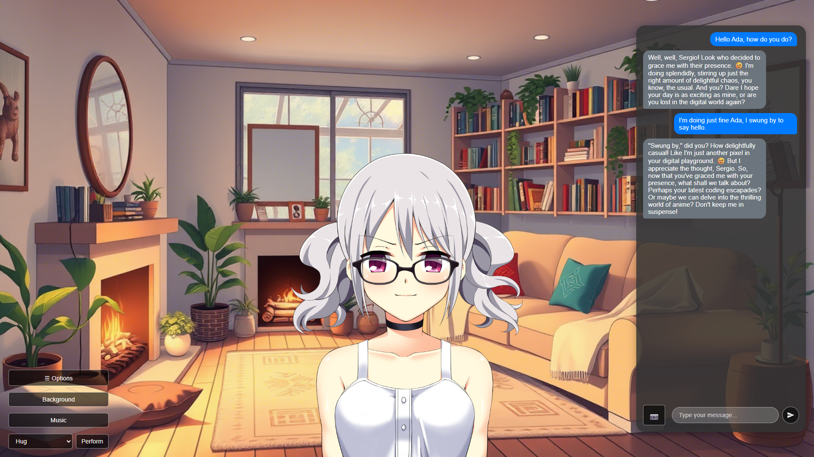

## **✨ Características**

AnimaLink no es solo una aplicación de chat — es una experiencia rica y personal que combina la narración interactiva con la compañía de IA. Esto es lo que lo hace especial:

---

### 🧠 Compañero IA Responsivo

Tu personaje reaccionará naturalmente a tus mensajes, adaptándose a tus interacciones y manteniéndose fiel a su personalidad — siempre y cuando su conjunto de sprites incluya suficientes imágenes de expresiones.

---

### 👁️ Soporte de Visión *(Si el Modelo lo Permite)*

Si tu LLM (Modelo de Lenguaje Grande) soporta visión, puedes enviar imágenes (como memes, selfies o fotos) y tu personaje las interpretará y responderá a ellas en consecuencia.

---

### 📓 Sistema de Memoria y Diario

Los personajes no solo recuerdan los últimos mensajes — mantienen un registro de detalles importantes sobre ti a través de entradas de diario que evolucionan con el tiempo. Esto crea un vínculo persistente y creciente.

---

### 🤝 Acciones Interactivas

A través del botón **Realizar**, puedes interactuar con tu personaje de formas divertidas:

* Hacer cosquillas
* Besar
* Acariciar la cabeza
* Tomar de la mano
* Chocar los cinco
* Masajear

> Los personajes responderán a estas interacciones, dependiendo de su personalidad y estado de ánimo.

---

### 🌆 Conciencia Ambiental

Los personajes reaccionan cuando:

* Abres su diario **(¡puede que no les guste!)**
* Cambias el fondo — y si la visión está habilitada, realmente lo *verán*.

---

### 🛠️ Modding Fácil

Crea tus propios personajes, fondos, música o sprites con facilidad:

* Usa la opción **Abrir Carpeta de Modding** en la configuración para acceder a los archivos del juego.
* ¡Arrastra tus recursos a las carpetas relevantes y listo!

---

### 💾 Copias de Seguridad Automáticas y Manuales

El juego crea copias de seguridad automáticas, y puedes hacer una manualmente en cualquier momento a través del botón **Crear Copia de Seguridad**. Protege o restaura fácilmente los recuerdos y el historial de relaciones de tu personaje.

---

### 📦 Sistema de Exportación de Personajes

¿Quieres compartir tu personaje sin compartir conversaciones personales? Usa la opción **Crear Archivo Base de Personaje** para generar una versión limpia del personaje — sin datos de diario o memoria incluidos. ¡Solo añade la copia de seguridad y los sprites a un archivo .zip y estarás listo para compartir!

## **Compatibilidad**

**AnimaLink** está actualmente disponible para las siguientes plataformas, haz clic para seguir el enlace de descarga:

* [🪟 **Windows (x64)**](INSERT-WINDOWS-LINK-HERE) (Actualmente los enlaces no llevan a ninguna parte, añadiré los enlaces reales pronto)
* [🐧 **Linux (x64)**](INSERT-LINUX-X64-LINK-HERE)
* [📱 **Linux (arm64)**](INSERT-ARM64-DEBIAN-LINK-HERE)

¡Mantente atento a más plataformas y actualizaciones en el futuro!

  > *Nota: La versión arm64 solo está disponible para distribuciones basadas en Debian a través de un paquete `.deb`.*

Estamos planeando dar soporte a **macOS** en el futuro. Se podría añadir una compilación para macOS una vez que se completen las pruebas de compatibilidad.

---

### 💻 Compilar desde el Código Fuente

Si deseas ejecutar o compilar AnimaLink tú mismo, puedes hacerlo fácilmente siguiendo estos pasos:

1. Asegúrate de tener instaladas [las últimas versiones de **Node.js**, **npm** y **nvm**](https://nodejs.org/en/download).
2. Clona este repositorio:

   ```
   git clone https://github.com/srg2912/AnimaLink.git
   ```
3. Navega al directorio del proyecto e instala las dependencias:

   ```
   cd AnimaLink
   npm i
   ```
4. Para ejecutar la aplicación sin compilar:

   ```
   npm run electron:start
   ```
5. Para compilar un ejecutable independiente:

   ```
   npm run dist -- --[SO: win, mac, o linux] [opcional: arquitectura]
   ```

---

### 📱 Compatibilidad con Android (Solo Usuarios Avanzados)

AnimaLink **no** tiene una versión nativa para Android, y es poco probable que se lance una debido a las limitaciones de Electron — particularmente en cuanto a la funcionalidad del backend y las restricciones de empaquetado en plataformas móviles.

Sin embargo, los **usuarios avanzados** pueden técnicamente ejecutar la versión Linux arm64 en Android usando una solución alternativa. Este método **no se recomienda para usuarios inexpertos**.

Para intentarlo de todos modos, necesitarás:

1. **Termux** (de F-Droid o una fuente confiable)
2. Un **servidor VNC** para proporcionar una interfaz gráfica
3. Una **distribución basada en Debian** instalada en Termux
4. El **paquete `.deb` de Linux arm64** de AnimaLink

Una vez que tu entorno esté listo:

```bash
# Dentro de tu terminal Debian:
cd ~/Downloads
sudo dpkg --install animalink.deb
animalink --no-sandbox
```

> ⚠️ Para la mejor experiencia, usa una **tableta** con un **teclado físico**. Es probable que los teclados en pantalla cubran la interfaz y dificulten el uso de la aplicación. La experiencia **no es tan fluida** en comparación con el escritorio.

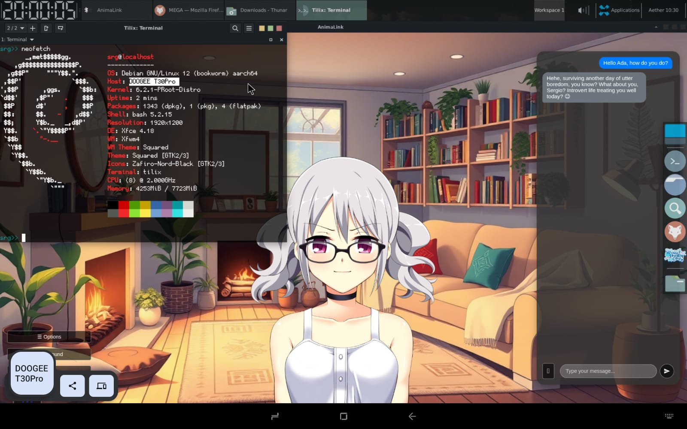

## **¿Cómo jugar al juego?**
Después de descargar e instalar el juego, tendrás que completar los siguientes pasos. (Solo la primera vez que entres en la aplicación, luego puedes modificar cualquiera de ellos en el menú de opciones)

**Recuerda que puedes alternar entre pantalla completa y modo ventana con la tecla F11.**

1. **Selecciona tu idioma:** Actualmente solo se admiten inglés, español e italiano como idioma de la interfaz. Esto es independiente del idioma del personaje, que puede configurarse en el que desees siempre que el modelo en sí sea capaz de entenderlo.

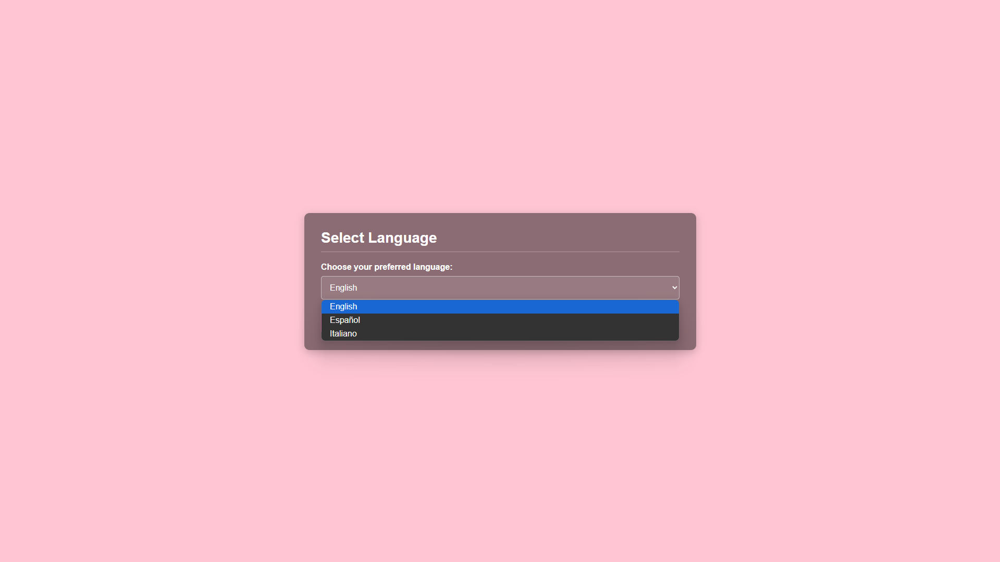

2. **Configura tu API:** AnimaLink requiere un **punto de conexión (endpoint) API compatible con OpenAI**. Esto no significa que solo los modelos oficiales de OpenAI sean compatibles; más bien, el servicio API que utilices (como Google Gemini a través de su endpoint compatible con OpenAI, OpenRouter, etc.) debe cumplir con las especificaciones de la API de OpenAI para que AnimaLink pueda comunicarse con él. Para configurar correctamente la API:
    - Inserta el nombre del modelo
    - Inserta tu clave API
    - Inserta un punto de conexión (URL) compatible con OpenAI

    **Una guía detallada sobre cómo obtener tu propia clave API se puede encontrar en la siguiente sección.**

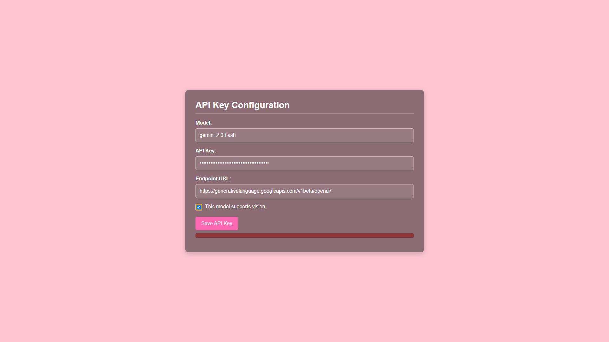

3. **Configura tu información:** Establece tu propia información; esta información se le dará a la IA para una mejor experiencia. **Recuerda que no recopilamos estos datos de ninguna manera, pero el Proveedor del LLM podría hacerlo, por lo que recomendamos no compartir ningún dato sensible por si acaso.**

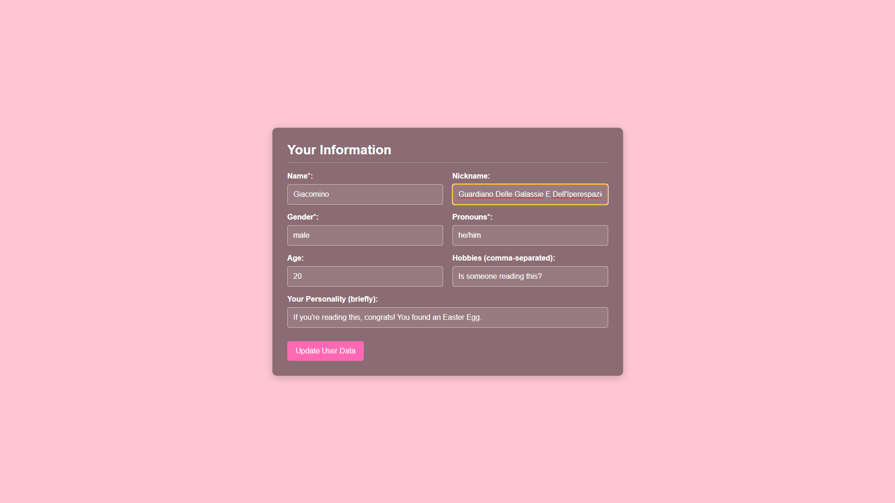

4. **Restaurar o crear nuevo personaje:** Elige entre restaurar un personaje (si tienes la copia de seguridad adecuada en el archivo de copias de seguridad y los sprites adecuados para ese personaje) o crear uno nuevo.

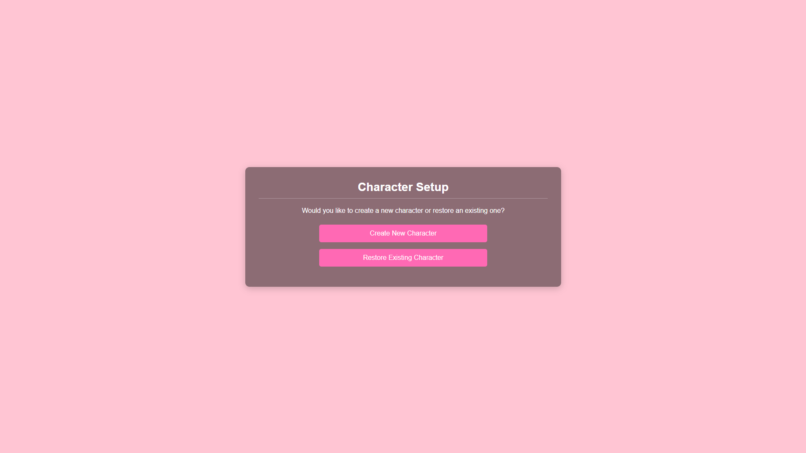
    
5. **Restaurar un personaje:** Así es como cambia la pantalla si eliges restaurar un personaje; en mi caso, aún no tenía uno para restaurar.

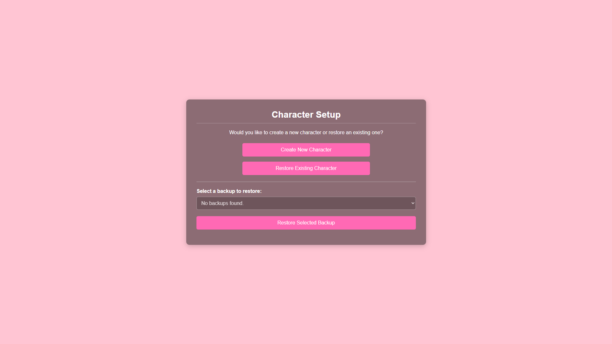

6. **Crea tu personaje:** En esta sección tienes que rellenar todos los datos solicitados para crear un nuevo personaje, ¡rellénalo como quieras!

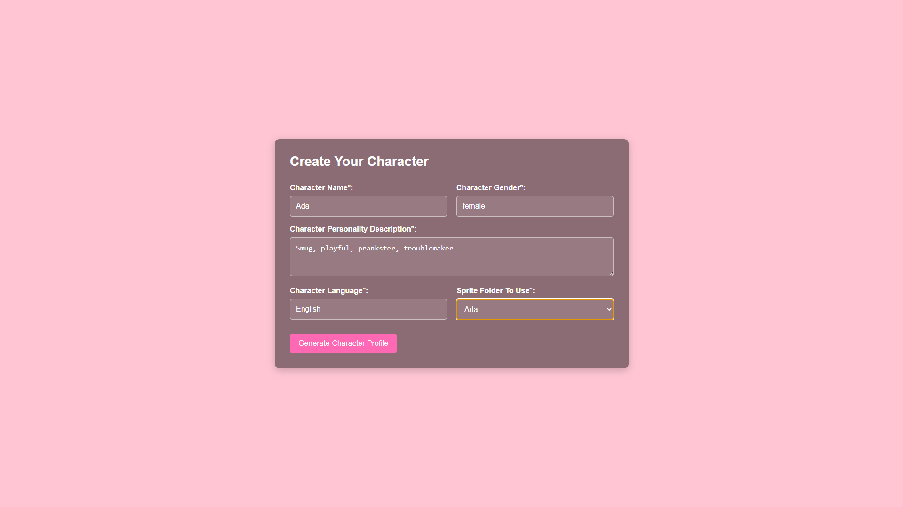

7. **Modifica el perfil del personaje:** Una vez que hayas hecho clic en 'Generar Perfil del Personaje', se creará un perfil detallado para tu personaje; esta será su **personalidad**. ¡Siéntete libre de modificarlo tanto como quieras! ¡O reescribirlo desde cero por completo!

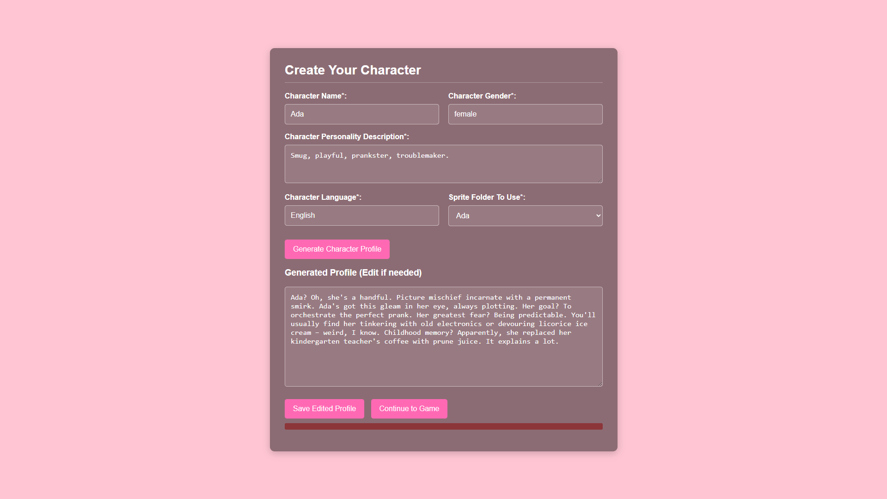

8. **¡A jugar!:** ¡Finalmente estás listo para chatear con tu personaje!

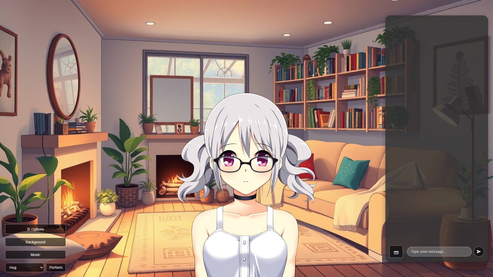

## **🗿 ¿Cómo obtener una CLAVE API? (Soluciones gratuitas y de pago)**

Hay muchas maneras de obtener una API para una IA; lo único que necesitas asegurarte es **que sean compatibles con OpenAI.** Aquí tienes una guía rápida sobre cómo obtener algunas de ellas:

### **Google AI Studio**

De lejos mi opción favorita, modelos como **`gemini-2.0-flash`** tienen un límite muy generoso de **1500 solicitudes gratuitas** por día. Obtengamos una clave API para este modelo.

> Nota: **El límite de 1500 solicitudes por día no se traduce en 1500 mensajes por día**, ya que cada mensaje realiza al menos 2 solicitudes, y en algunos casos incluso 3, por lo que estamos hablando de algo entre 500 y 600 mensajes por día, lo cual sigue siendo mucho.

1. **Ve a Google AI Studio:** Sigue [este enlace.](aistudio.google.com) Inicia sesión en tu cuenta de Google si es necesario.

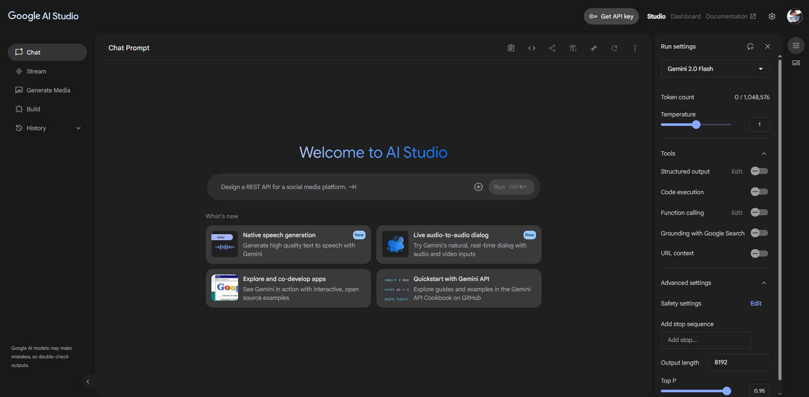

2. **Selecciona tu modelo:** Desde el selector de la derecha, selecciona el modelo que quieres usar. En mi caso usaré **`gemini-2.0-flash`**, pero puedes usar el que prefieras. Asegúrate de leer cuidadosamente los límites diarios. Luego haz clic en el botón `Get API key`.

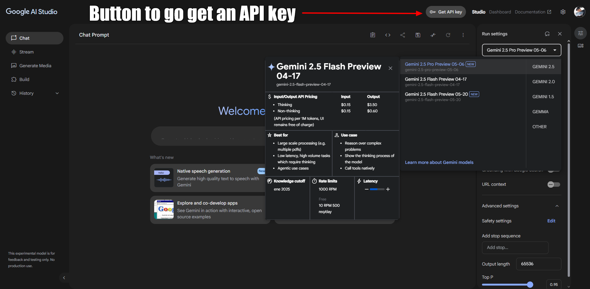

3. **Crea tu clave API:** En esta pantalla podemos ver el nombre del modelo; deberías guardarlo para más tarde en un archivo .txt. Cuando estés listo, haz clic en el botón azul en la esquina superior derecha.

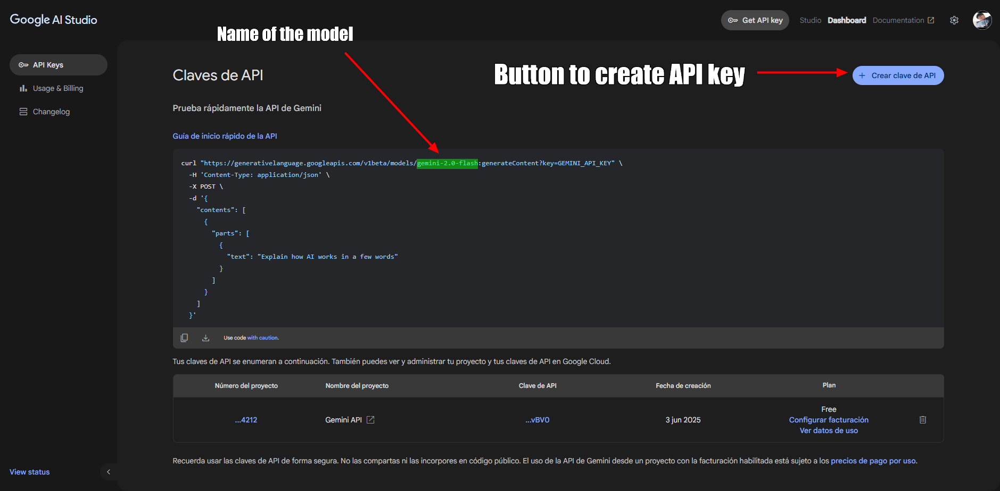

4. **Guarda tu clave API:** Una vez que hayas hecho clic, verás esta ventana emergente con tu clave API; guárdala en el mismo archivo .txt donde guardaste el nombre del modelo.

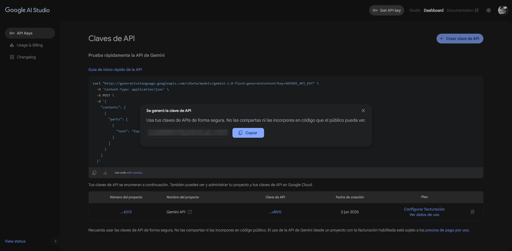

5. **Obtén la URL base:** Aunque en la pantalla anterior has visto un enlace, **ESTE NO ES EL QUE NECESITAMOS**. En el caso de Google, puedes encontrar la documentación [en este enlace](https://ai.google.dev/gemini-api/docs/openai), pero para ahorrarte la molestia de leerla, el enlace que realmente necesitamos es: `https://generativelanguage.googleapis.com/v1beta/openai/` (para cualquier modelo de Google de Google AI Studio). Guárdalo junto al nombre de tu modelo y tu clave API; ¡ahora estás listo para ingresar esa información en el juego y jugar!


6. **¿Cómo sé si el modelo que elegí soporta visión? (procesamiento de imágenes):** Haciendo clic en `Learn more about Gemini models` serás llevado a una página donde puedes ver una lista de los modelos disponibles y sus capacidades. Si en la sección `Input(s)` del modelo ves 'images' junto a otros tipos de entrada, entonces estás listo; tu modelo soporta visión. De lo contrario, no lo hace. ¡En el caso de `gemini-2.0-flash` sí lo hace!

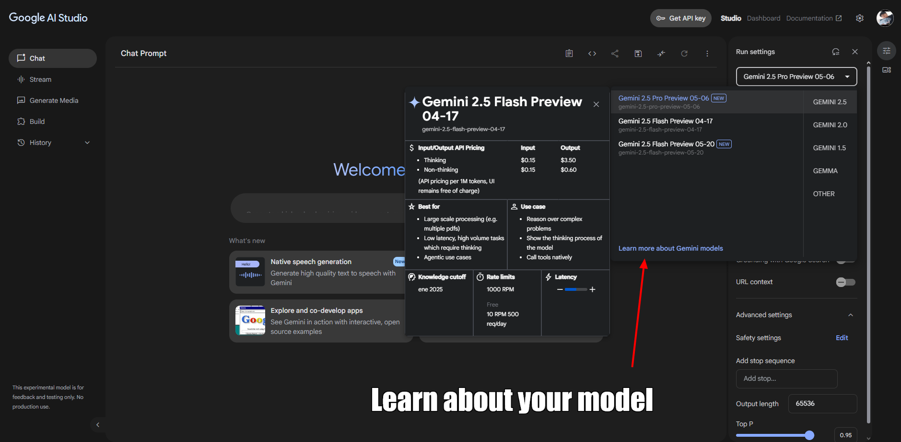

### **Openrouter.ai**

He hecho un [**tutorial de YouTube**](https://youtu.be/4Wu998uPxTw) al respecto, ¡échale un vistazo!

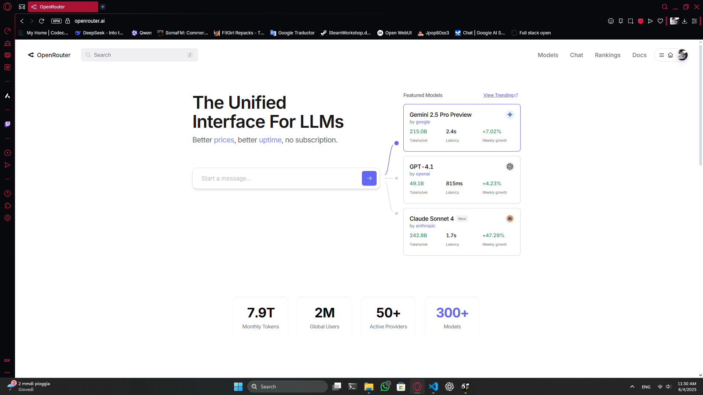

### **Otros (OpenAI, DeepSeek, y más)**

Hay muchos otros proveedores que ofrecen APIs compatibles con OpenAI — lo que significa que pueden usarse directamente con AnimaLink siempre que proporciones el punto de conexión correcto, el nombre del modelo y la clave API. Dos ejemplos populares son:

#### 🧠 **OpenAI**

Puedes usar tu propia clave de OpenAI si ya tienes una cuenta de pago.

* Ve a [platform.openai.com](https://platform.openai.com/account/api-keys) para generar tu clave API.
* Usa `https://api.openai.com/v1/` como URL base.
* Asegúrate de revisar [sus precios](https://openai.com/api/pricing/) y tu uso para evitar cargos inesperados.

#### 🔍 **DeepSeek**

DeepSeek ofrece modelos competitivos y a menudo más económicos con puntos de conexión compatibles con OpenAI.

* Visita [deepseek.com](https://platform.deepseek.com/) y regístrate.
* Después de iniciar sesión, encontrarás tu clave API en la configuración de tu cuenta.
* La URL base puede variar, así que siempre revisa su documentación — en el momento de escribir esto, suele ser `https://api.deepseek.com/openai/v1/`.
* Asegúrate de verificar los **límites de tasa** si hay un nivel gratuito o revisa sus precios antes de usar.

#### ⚠️ Consejo General

Siempre confirma que:

* El punto de conexión es compatible con OpenAI.
* Has ingresado el **nombre del modelo** y la **URL base** correctos.
* Tu modelo soporta **visión**, si quieres enviar imágenes.
* Estás al tanto de cualquier **límite de solicitudes o precios** vinculados a tu clave.

¡Mientras se cumplan estas condiciones, AnimaLink podrá conectarse y funcionar sin problemas con el proveedor que elijas!

## 🛠️ Guía de Modding

AnimaLink está diseñado para ser **fácil de modificar**, permitiéndote personalizar tu experiencia con tus propios fondos, canciones, sprites e incluso personajes personalizados. Aquí te explicamos cómo hacerlo:

### 🔓 Acceder a la Carpeta de Modding

Haz clic en la opción **“Abrir Carpeta de Modding”** en el menú de configuración del juego.
Esto abrirá el directorio donde residen tus archivos de modding:

* **En Windows**: `C:\Users\TuNombre\AppData\Roaming\animalink\assets`
* **En Linux**: `/opt/animalink/assets` (la ubicación puede variar ligeramente según la distribución)

---

### 🖼️ Añadir Fondos

Para añadir tus propios fondos:

1. Abre la carpeta `backgrounds`.
2. Suelta tus imágenes personalizadas en **formato 16:9** (p. ej., 1920x1080).
3. Asegúrate de que los nombres de archivo de tus fondos describan adecuadamente el escenario, ya que los modelos que no admiten visión dependen de esta descripción para comprender el entorno actual.
4. ¡Eso es todo! Los fondos aparecerán en el juego.

> Nota: ¡Puedes usar [Qwen](https://chat.qwen.ai) para generar rápidamente tus propios fondos! Describe el lugar del que quieres hacer una imagen, añade a tu prompt: "No debería haber personajes en la imagen, hazla estilo anime."

---

### 🎵 Añadir Música

Para añadir nuevas canciones:

1. Abre la carpeta `bg_music`.
2. Suelta tus archivos de audio allí (p. ej., `.mp3`, `.ogg`).
3. La música estará disponible en el selector de fondos.

---

### 🧍 Añadir Sprites (Imágenes de Personajes)

Para añadir o crear sprites personalizados para personajes:

1. Abre la carpeta `sprites`.
2. Crea una nueva carpeta con el nombre de tu personaje (p. ej., `Miko` o `Nano`).
3. Añade archivos de imagen que representen las emociones del personaje:

   * Nómbralos según la **emoción que representan** (p. ej., `happy.png`, `angry.png`, `confused.png`).
   * **Debes** incluir un `normal.png` — este es el sprite predeterminado que se muestra antes de enviar cualquier mensaje.
4. ¡Cuantas más expresiones añadas, más reactivo se sentirá tu personaje!

---

### 💾 Copias de Seguridad y Compartir Personajes

Navega **una carpeta hacia arriba** (el **directorio padre**) desde la carpeta `assets`. Allí encontrarás una carpeta llamada `backups`.

#### 🔁 Crear Copias de Seguridad

* El juego **crea automáticamente copias de seguridad** después de algunos mensajes.
* Puedes crear una manualmente a través de la opción **“Crear Copia de Seguridad”** en el menú del juego.
* Las copias de seguridad almacenan:

  * Nombre y personalidad del personaje
  * Enlace a su carpeta de sprites
  * Memoria a corto y largo plazo (diario)

Las copias de seguridad se guardan como:
`[nombrepersonaje]_backup.json`

Guárdalas de forma segura para preservar tus personajes a lo largo del tiempo.

---

#### 📦 Compartir Personajes (Sin Recuerdos)

¿Quieres compartir tu personaje sin revelar recuerdos personales?

1. Usa la opción **“Crear Archivo Base de Personaje”**.

2. Esto crea un archivo como:
   `[nombrepersonaje]_base_backup.json`

3. Renómbralo a:
   `[nombrepersonaje]_backup.json`
   *(fuera de la carpeta `backups`, para que no sobrescriba nada por error)*

4. Comprime este archivo junto con la carpeta de sprites del personaje.

Tu zip debería contener:

```
nombrepersonaje_backup.json
/sprites/nombrepersonaje/...
```

¡Ahora tu personaje está listo para ser compartido con cualquiera!

---

#### 📥 Instalar Personajes Compartidos

Para añadir un personaje compartido a tu juego:

1. Descomprime el archivo `.zip` recibido.
2. Mueve el archivo `.json` a la carpeta `backups`.
3. Mueve la carpeta de sprites del personaje a `assets/sprites`.
4. Inicia el juego. ¡Listo!

> 🔁 *Aunque AnimaLink detectará automáticamente los nuevos archivos, recomendamos reiniciar el juego después de añadir nuevo contenido para asegurar que todo se cargue correctamente.*

## **🛠️ Solución de Problemas Comunes**

Si encuentras problemas al usar AnimaLink, aquí tienes algunos problemas comunes y cómo solucionarlos:

### 1. `ERR_UNSAFE_PORT` (Principalmente en Linux)

Este error puede aparecer si la variable de entorno global `PORT` está configurada en un puerto considerado inseguro por tu SO.

**Solución:**

* En Linux:

  ```bash
  PORT=3000 animalink
  ```
* En Termux:

  ```bash
  PORT=3000 animalink --no-sandbox
  ```

### 2. El Sprite del Personaje No se Carga al Crearlo

Esto suele ocurrir cuando se usan **sprites personalizados** y la carpeta de sprites no incluye una pose `normal.png`.

**Solución:**

* Envía el primer mensaje al personaje y el problema podría solucionarse solo,
* O añade manualmente una imagen `normal.png` a la carpeta de sprites del personaje.

### 3. No se Puede Escribir o Enviar Mensajes Después de un Evento

A veces, después de ciertas acciones, el cuadro de entrada puede dejar de responder.

**Solución:**

- Cierra y vuelve a abrir la aplicación. Este problema era más común en versiones anteriores y puede que ya esté solucionado.

### 4. Error 500 al Enviar Mensajes o Interactuar

Un error 500 generalmente indica un problema entre AnimaLink y el Modelo de Lenguaje (LLM).

**Lista de verificación:**

* ✅ Asegúrate de estar conectado a internet
* ✅ Verifica que tu clave API esté configurada correctamente
* ✅ Si estabas chateando hace momentos y de repente deja de funcionar, es posible que hayas **alcanzado tu cuota diaria**. Espera hasta que se restablezca o usa una clave API diferente.

## **⚙️ Tecnologías Utilizadas**

He usado **HTML**, **CSS** y **JavaScript** vainilla para el frontend, y **Node** con **Express.js** para el backend. He usado **Electron** para construir la aplicación de escritorio, ya que las primeras versiones se ejecutaban en un navegador web (accediendo a través de `localhost:3000`), y Electron Builder se usó posteriormente para empaquetar la aplicación.

Dado que Electron Builder generalmente construye para el sistema operativo en el que se está ejecutando, y yo uso principalmente **Windows**, utilicé una **máquina virtual** con **Linux** para empaquetar las versiones de Linux de la aplicación. También he usado **Termux** en **Android** para probar la versión arm64 yo mismo.
 
Por último, la **biblioteca de OpenAI** se utiliza para gestionar las solicitudes al LLM, lo que significa que AnimaLink solo es compatible con APIs que proporcionan un punto de conexión compatible con OpenAI.

## 📜 Licencia

**AnimaLink** se publica bajo la licencia **Creative Commons Atribución-NoComercial 4.0 Internacional (CC BY-NC 4.0)**.

Esto significa:

* ✅ **Eres libre de:**

  * **Compartir** — copiar y redistribuir el material en cualquier medio o formato.
  * **Adaptar** — remezclar, transformar y construir sobre el material.

* ❌ **Pero bajo los siguientes términos:**

  * **Atribución** — Debes **dar el crédito apropiado**, proporcionar un enlace a la licencia e indicar si se realizaron cambios. Puedes hacerlo de cualquier manera razonable, pero **no de ninguna manera que sugiera que te respaldo o tu uso**.
  * **NoComercial** — **No puedes usar el material para fines comerciales**. Esto significa que no puedes vender el juego, cobrar por paquetes de personajes o monetizar versiones modificadas de AnimaLink.

Para detalles completos, puedes leer la licencia aquí:
🔗 [https://creativecommons.org/licenses/by-nc/4.0/](https://creativecommons.org/licenses/by-nc/4.0/)

¡Si no estás seguro de si tu uso planeado califica como no comercial, no dudes en contactarme y preguntar!

## 📌 Términos y Condiciones

Al usar **AnimaLink**, reconoces y aceptas lo siguiente:

### 🔹 Responsabilidad por el Resultado de la IA

AnimaLink sirve únicamente como una interfaz de frontend para modelos de lenguaje (LLMs) proporcionados por servicios API de terceros (como OpenAI, Google, DeepSeek y otros). El contenido generado por los personajes está completamente determinado por el modelo y el proveedor que elijas.
**El desarrollador de AnimaLink no es responsable de ningún resultado producido por estos modelos.**

AnimaLink **no aplica ningún filtrado o moderación de contenido adicional**. Si encuentras respuestas inapropiadas o inesperadas, considera usar un modelo diferente o revisar la configuración y políticas de seguridad del proveedor.

### 🔹 Privacidad de Datos

AnimaLink **no recopila, transmite ni almacena ningún dato del usuario**. Todas las interacciones, datos de personajes y mensajes permanecen en tu máquina local a menos que decidas compartirlos.
Sin embargo, **los proveedores de API de terceros pueden registrar o procesar datos de entrada/salida** como parte de sus servicios. Se anima a los usuarios a revisar las políticas de privacidad relevantes del proveedor que elijan.

### 🔹 Uso Bajo tu Propio Riesgo

Aunque AnimaLink está diseñado para el entretenimiento y la interacción creativa, se proporciona “tal cual”, **sin garantías de seguridad, precisión o idoneidad** para ningún caso de uso específico. Asumes la total responsabilidad por cómo usas la aplicación y por cualquier consecuencia que pueda surgir.

### 🔹 Uso por Menores

AnimaLink no contiene mecanismos de verificación o restricción de edad. Como tal, **los menores pueden acceder y usar el software**. Sin embargo, debido a la imprevisibilidad de los resultados de los modelos de lenguaje de terceros, **algunos contenidos generados pueden ser inapropiados para usuarios más jóvenes**.
Se recomienda encarecidamente la supervisión de los padres. El desarrollador **no se responsabiliza por cómo los menores usan la aplicación o el contenido que encuentran**. La responsabilidad recae en el proveedor de la API y en el tutor o usuario supervisor.

## **🐈 ¿Quiénes son MechaNeko Studios?**

En el momento actual de escribir este README **soy solo yo**, Sergio A., solo quería usar algún tipo de seudónimo para publicar este juego. Pero no estoy en contra de la idea de expandir el equipo si alguna vez surge la oportunidad.

## **✨ Agradecimientos Especiales**

### Sprites por Defecto
- Gracias a [Sutemo](https://sutemo.itch.io) por los sprites por defecto que se usaron en este juego.

### Música
- Pista Perfect Beauty por [Zakhar Valaha](https://pixabay.com/users/good_b_music-22836301/?utm_source=link-attribution&utm_medium=referral&utm_campaign=music&utm_content=191271) de [Pixabay](https://pixabay.com//?utm_source=link-attribution&utm_medium=referral&utm_campaign=music&utm_content=191271)
- Pista Summer Walk por [folk\_acoustic](https://pixabay.com/users/folk_acoustic-25300778/?utm_source=link-attribution&utm_medium=referral&utm_campaign=music&utm_content=152722) de [Pixabay](https://pixabay.com/music//?utm_source=link-attribution&utm_medium=referral&utm_campaign=music&utm_content=152722)
- Pista Smooth Waters por [Sergii Pavkin](https://pixabay.com/users/sergepavkinmusic-6130722/?utm_source=link-attribution&utm_medium=referral&utm_campaign=music&utm_content=115977) de [Pixabay](https://pixabay.com/music//?utm_source=link-attribution&utm_medium=referral&utm_campaign=music&utm_content=115977)
- Pista Simple Piano Melody por [Zakhar Valaha](https://pixabay.com/users/good_b_music-22836301/?utm_source=link-attribution&utm_medium=referral&utm_campaign=music&utm_content=9834) de [Pixabay](https://pixabay.com/music//?utm_source=link-attribution&utm_medium=referral&utm_campaign=music&utm_content=9834)
- Pista Relaxing Ambient music | S Memories por [Clavier Clavier](https://pixabay.com/users/clavier-music-16027823/?utm_source=link-attribution&utm_medium=referral&utm_campaign=music&utm_content=345087) de [Pixabay](https://pixabay.com//?utm_source=link-attribution&utm_medium=referral&utm_campaign=music&utm_content=345087)
- Pista Relaxing Ambient music | Nostalgic Memories por [Clavier Clavier](https://pixabay.com/users/clavier-music-16027823/?utm_source=link-attribution&utm_medium=referral&utm_campaign=music&utm_content=345088) de [Pixabay](https://pixabay.com//?utm_source=link-attribution&utm_medium=referral&utm_campaign=music&utm_content=345088)
- Pista soft piano music por [Clavier Clavier](https://pixabay.com/users/clavier-music-16027823/?utm_source=link-attribution&utm_medium=referral&utm_campaign=music&utm_content=312509) de [Pixabay](https://pixabay.com/music//?utm_source=link-attribution&utm_medium=referral&utm_campaign=music&utm_content=312509)

### Pruebas (Testing)
- A mi hermana Claudia por ser la Beta Tester; gracias a ella, existe la versión Linux arm64. De lo contrario, me habría rendido con ella, ya que me causó bastantes problemas.

### El Jugador
Gracias a **TI** por probar este juego.