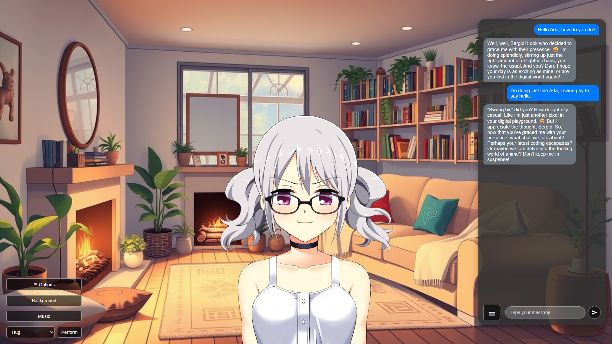
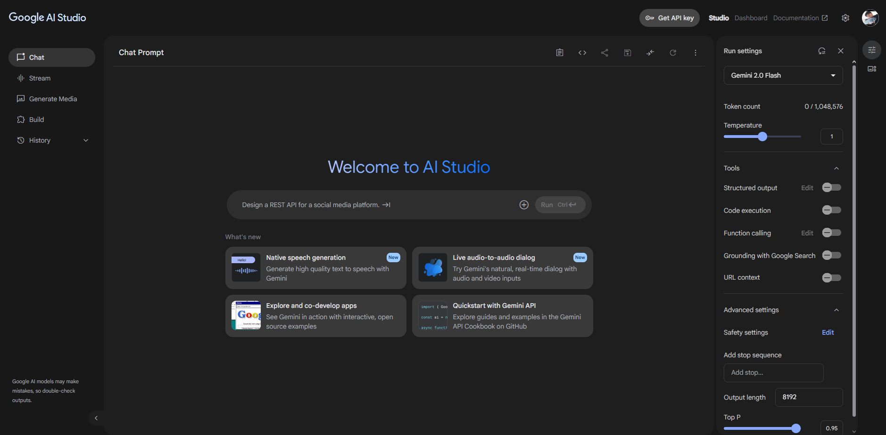
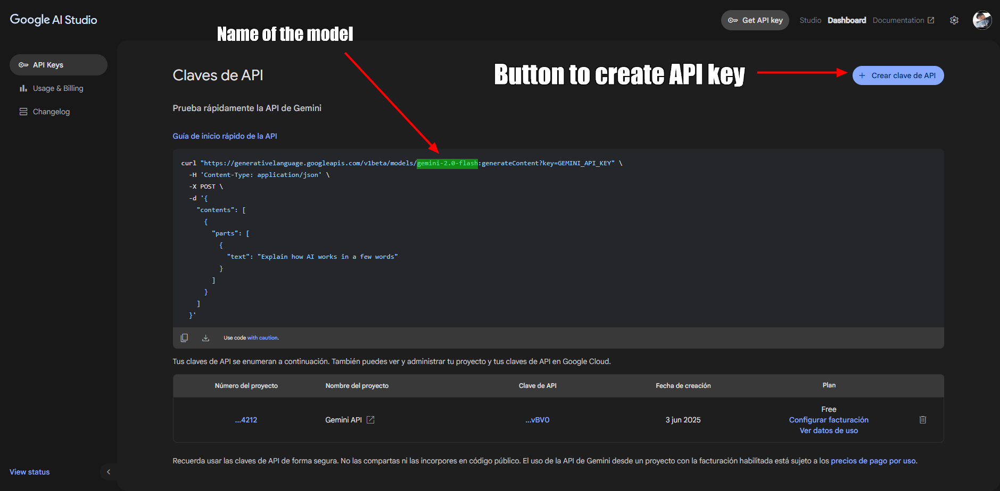
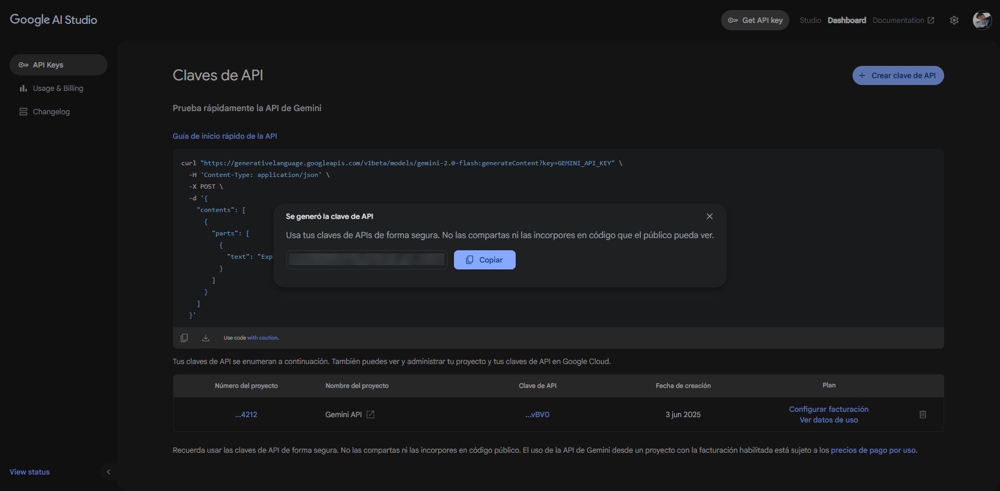
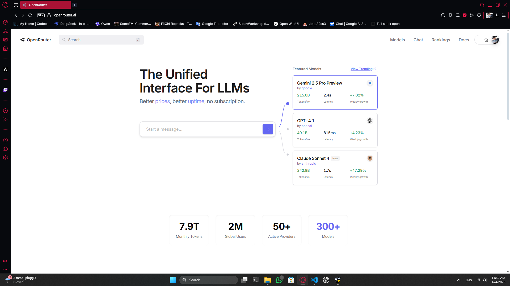

# **AnimaLink**
**🌐 Lingua: [English](README.md) | [Español](README.es.md) | [Italiano](README.it.md)**
**🔗 Uniti al nostro [Discord](https://discord.gg/hXeYb8up)**

## Indice dei Contenuti
- [**AnimaLink**](#animalink)
  - [Indice dei Contenuti](#indice-dei-contenuti)
  - [**Allora... Cos'è AnimaLink?**](#allora-cosè-animalink)
  - [**✨ Caratteristiche**](#-caratteristiche)
    - [🧠 Compagno IA Reattivo](#-compagno-ia-reattivo)
    - [👁️ Supporto Visivo *(Se il Modello lo Permette)*](#️-supporto-visivo-se-il-modello-lo-permette)
    - [📓 Sistema di Memoria e Diario](#-sistema-di-memoria-e-diario)
    - [🤝 Azioni Interattive](#-azioni-interattive)
    - [🌆 Consapevolezza Ambientale](#-consapevolezza-ambientale)
    - [🛠️ Modding Facile](#️-modding-facile)
    - [💾 Backup Automatici e Manuali](#-backup-automatici-e-manuali)
    - [📦 Sistema di Esportazione dei Personaggi](#-sistema-di-esportazione-dei-personaggi)
  - [**Compatibilità**](#compatibilità)
    - [🪟 Installare su Windows](#-installare-su-windows)
    - [🐧 Installare su Linux x86\_64](#-installare-su-linux-x86_64)
    - [📱 Installare su Linux arm64](#-installare-su-linux-arm64)
    - [💻 Compilare dal Codice Sorgente](#-compilare-dal-codice-sorgente)
    - [📱 Compatibilità Android (Solo Utenti Esperti)](#-compatibilità-android-solo-utenti-esperti)
  - [**Come si gioca?**](#come-si-gioca)
  - [**🗿 Come ottenere una CHIAVE API? (Soluzioni gratuite e a pagamento)**](#-come-ottenere-una-chiave-api-soluzioni-gratuite-e-a-pagamento)
    - [**Google AI Studio**](#google-ai-studio)
    - [**Openrouter.ai**](#openrouterai)
    - [**Altri (OpenAI, DeepSeek, e altri)**](#altri-openai-deepseek-e-altri)
      - [🧠 **OpenAI**](#-openai)
      - [🔍 **DeepSeek**](#-deepseek)
      - [⚠️ Consiglio Generale](#️-consiglio-generale)
  - [🛠️ Guida al Modding](#️-guida-al-modding)
    - [🔓 Accedere alla Cartella di Modding](#-accedere-alla-cartella-di-modding)
    - [🖼️ Aggiungere Sfondi](#️-aggiungere-sfondi)
    - [🎵 Aggiungere Musica](#-aggiungere-musica)
    - [🧍 Aggiungere Sprite (Immagini dei Personaggi)](#-aggiungere-sprite-immagini-dei-personaggi)
    - [💾 Backup e Condivisione dei Personaggi](#-backup-e-condivisione-dei-personaggi)
      - [🔁 Creare Backup](#-creare-backup)
      - [📦 Condividere Personaggi (Senza Ricordi)](#-condividere-personaggi-senza-ricordi)
      - [📥 Installare Personaggi Condivisi](#-installare-personaggi-condivisi)
  - [**🛠️ Risoluzione dei Problemi Comuni**](#️-risoluzione-dei-problemi-comuni)
    - [1. `ERR_UNSAFE_PORT` (Principalmente su Linux)](#1-err_unsafe_port-principalmente-su-linux)
    - [2. Lo Sprite del Personaggio Non si Carica alla Creazione](#2-lo-sprite-del-personaggio-non-si-carica-alla-creazione)
    - [3. Impossibile Digitare o Inviare Messaggi Dopo un Evento](#3-impossibile-digitare-o-inviare-messaggi-dopo-un-evento)
    - [4. Errore 500 Durante l'Invio di Messaggi o l'Interazione](#4-errore-500-durante-linvio-di-messaggi-o-linterazione)
  - [**⚙️ Tecnologie Utilizzate**](#️-tecnologie-utilizzate)
  - [📜 Licenza](#-licenza)
  - [📌 Termini e Condizioni](#-termini-e-condizioni)
    - [🔹 Responsabilità per l'Output dell'IA](#-responsabilità-per-loutput-dellia)
    - [🔹 Privacy dei Dati](#-privacy-dei-dati)
    - [🔹 Uso a Proprio Rischio](#-uso-a-proprio-rischio)
    - [🔹 Uso da Parte di Minori](#-uso-da-parte-di-minori)
  - [**🐈 Chi sono i MechaNeko Studios?**](#-chi-sono-i-mechaneko-studios)
  - [💖 Ti è piaciuto questo progetto?](#-ti-è-piaciuto-questo-progetto)
  - [**✨ Ringraziamenti Speciali**](#-ringraziamenti-speciali)
    - [Sprite Predefiniti](#sprite-predefiniti)
    - [Musica](#musica)
    - [Testing](#testing)
    - [Il Giocatore](#il-giocatore)

## **Allora... Cos'è AnimaLink?**
AnimaLink è un'esperienza desktop interattiva dove puoi creare e connetterti con personaggi unici potenziati dall'IA che vivono in un mondo simile a una visual novel. Ogni personaggio è profondamente personalizzato, plasmato dal tuo input e capace di formare legami duraturi attraverso conversazioni naturali e memoria emotiva.

Questi compagni non sono semplici chatbot passivi — crescono al tuo fianco. Ogni interazione li aiuta a imparare di più su di te, e riflettono sui vostri momenti condivisi attraverso voci di diario scritte dal personaggio che fungono da memoria a lungo termine.

AnimaLink include anche funzionalità interattive che danno vita ai tuoi personaggi. Puoi compiere azioni come abbracciare, accarezzare la testa o persino fargli il solletico con un clic — e reagiranno di conseguenza in base alla loro personalità. Rispondono anche dinamicamente quando cambi lo sfondo del loro mondo o apri il loro diario, facendoli sentire veramente presenti.

Che tu stia cercando un amico, un confidente o semplicemente una presenza gentile sul tuo desktop, AnimaLink offre uno spazio confortante dove il tuo compagno IA è sempre felice di vederti.



## **✨ Caratteristiche**

AnimaLink non è solo un'app di chat — è un'esperienza ricca e personale che fonde la narrazione interattiva con la compagnia dell'IA. Ecco cosa lo rende speciale:

---

### 🧠 Compagno IA Reattivo

Il tuo personaggio reagirà naturalmente ai tuoi messaggi, adattandosi alle tue interazioni e rimanendo fedele alla sua personalità — a condizione che il suo set di sprite includa abbastanza immagini di espressioni.

---

### 👁️ Supporto Visivo *(Se il Modello lo Permette)*

Se il tuo LLM (Large Language Model) supporta la visione, puoi inviare immagini (come meme, selfie o foto) e il tuo personaggio le interpreterà e risponderà di conseguenza.

---

### 📓 Sistema di Memoria e Diario

I personaggi non ricordano solo gli ultimi messaggi — tengono traccia di dettagli importanti su di te attraverso voci di diario che evolvono nel tempo. Questo crea un legame persistente e crescente.

---

### 🤝 Azioni Interattive

Attraverso il pulsante **Esegui**, puoi coinvolgere il tuo personaggio in interazioni divertenti:

* Solleticare
* Baciare
* Accarezzare la testa
* Tenere la mano
* Battere il cinque
* Massaggiare

> I personaggi risponderanno a queste interazioni, a seconda della loro personalità e del loro umore.

---

### 🌆 Consapevolezza Ambientale

I personaggi reagiscono quando:

* Apri il loro diario **(potrebbe non piacergli!)**
* Cambi lo sfondo — e se la visione è abilitata, lo *vedranno* effettivamente.

---

### 🛠️ Modding Facile

Crea facilmente i tuoi personaggi, sfondi, musica o sprite:

* Usa l'opzione **Apri Cartella Modding** nelle impostazioni per accedere ai file di gioco.
* Trascina i tuoi asset nelle cartelle pertinenti e hai finito!

---

### 💾 Backup Automatici e Manuali

Il gioco crea backup automatici, e puoi crearne uno manualmente in qualsiasi momento tramite il pulsante **Crea Backup**. Salvaguarda o ripristina facilmente i ricordi e la cronologia delle relazioni del tuo personaggio.

---

### 📦 Sistema di Esportazione dei Personaggi

Vuoi condividere il tuo personaggio senza condividere conversazioni personali? Usa l'opzione **Crea File Base Personaggio** per generare una versione pulita del personaggio — senza dati di diario o memoria inclusi. Aggiungi semplicemente il backup e gli sprite in un file .zip e sei pronto per condividere!

## **Compatibilità**

**AnimaLink** è attualmente disponibile per le seguenti piattaforme, clicca per seguire il link per il download:

* 🪟 **Windows (x64)**
* 🐧 **Linux (x64)**
* 📱 **Linux (arm64)**

Puoi scaricare il gioco [seguendo questo link](https://mechanekostudios.itch.io/animalink).

  > *Nota: La versione arm64 è disponibile solo per distribuzioni basate su Debian tramite pacchetto `.deb`.*

Stiamo pianificando di supportare **macOS** in futuro. Una build per macOS potrebbe essere aggiunta una volta completati i test di compatibilità.

---

### 🪟 Installare su Windows

Scarica il file `.exe`, fai doppio clic per installarlo, scegli dove posizionare i file del gioco e sei pronto!

---

### 🐧 Installare su Linux x86_64

1. Scarica il file `.AppImage`.
2. Apri il terminale e vai nella cartella Download:

  ```
  cd ~/Downloads
  ```

3. Esegui il comando:

  ```
  ./AnimaLink-1.0.0.AppImage --no-sandbox
  ```

---

### 📱 Installare su Linux arm64

1. Scarica il file `.deb`.
2. Apri il terminale e vai nella cartella Download:

  ```
  cd ~/Downloads
  ```

3. Per installarlo, esegui:

  ```
  sudo dpkg --install animalink_1.0.0_arm64.deb
  ```

4. Per giocare, esegui:
  ```
  animalink --no-sandbox
  ```

---

### 💻 Compilare dal Codice Sorgente

Se desideri eseguire o compilare AnimaLink autonomamente, puoi farlo facilmente seguendo questi passaggi:

1. Assicurati di avere installato [le ultime versioni di **Node.js**, **npm** e **nvm**](https://nodejs.org/en/download).
2. Clona questo repository:

   ```
   git clone https://github.com/srg2912/AnimaLink.git
   ```
3. Naviga nella directory del progetto e installa le dipendenze:

   ```
   cd AnimaLink
   npm i
   ```
4. Per eseguire l'app senza compilare:

   ```
   npm run electron:start
   ```
5. Per compilare un eseguibile standalone:

   ```
   npm run dist -- --[SO: win, mac, o linux] [opzionale: architettura]
   ```

---

### 📱 Compatibilità Android (Solo Utenti Esperti)

AnimaLink **non** ha una versione nativa per Android, ed è improbabile che venga rilasciata a causa delle limitazioni di Electron — in particolare per quanto riguarda la funzionalità del backend e i vincoli di pacchettizzazione sulle piattaforme mobili.

Tuttavia, gli **utenti esperti** possono tecnicamente eseguire la versione Linux arm64 su Android utilizzando un workaround. Questo metodo **non è raccomandato per utenti inesperti**.

Per provarlo comunque, avrai bisogno di:

1. **Termux** (da F-Droid o una fonte attendibile)
2. Un **server VNC** per fornire un'interfaccia grafica
3. Una **distro basata su Debian** installata in Termux
4. Il **pacchetto `.deb` Linux arm64** di AnimaLink

Una volta che il tuo ambiente è pronto:

```bash
# All'interno del tuo terminale Debian:
cd ~/Downloads
sudo dpkg --install animalink.deb
animalink --no-sandbox
```

> ⚠️ Per la migliore esperienza, usa un **tablet** con una **tastiera fisica**. Le tastiere su schermo probabilmente copriranno l'interfaccia e renderanno l'app difficile da usare. L'esperienza **non è fluida** come su desktop.


## **Come si gioca?**
Dopo aver scaricato e installato il gioco, dovrai completare i seguenti passaggi. (Solo la prima volta che accedi all'app, poi potrai modificare qualsiasi impostazione dal menu opzioni)

**Ricorda che puoi passare dalla modalità Schermo Intero a Finestra con il tasto F11.**

1. **Seleziona la tua lingua:** Attualmente sono supportati solo Inglese, Spagnolo e Italiano come lingua dell'interfaccia. Questo è indipendente dalla lingua del personaggio, che può essere impostata su qualsiasi lingua tu desideri, purché il modello stesso sia in grado di comprenderla.


2. **Imposta la tua API:** AnimaLink richiede un **endpoint API compatibile con OpenAI**. Ciò non significa che siano supportati solo i modelli ufficiali di OpenAI; piuttosto, il servizio API che utilizzi (come Google Gemini tramite il suo endpoint compatibile con OpenAI, OpenRouter, ecc.) deve essere conforme alle specifiche dell'API di OpenAI affinché AnimaLink possa comunicare con esso. Per impostare correttamente l'API:
    - Inserisci il nome del modello
    - Inserisci la tua chiave API
    - Inserisci un endpoint (URL) compatibile con OpenAI

    **Una guida dettagliata su come ottenere la tua chiave API si trova nella prossima sezione.**


3. **Imposta le tue informazioni:** Imposta le tue informazioni personali; queste informazioni verranno fornite all'IA per una migliore esperienza. **Ricorda che non raccogliamo questi dati in alcun modo, ma il Provider LLM potrebbe farlo, quindi raccomandiamo di non condividere dati sensibili per precauzione.**


4. **Ripristina o crea un nuovo personaggio:** Scegli tra ripristinare un personaggio (se hai il backup appropriato nel file dei backup e gli sprite appropriati per quel personaggio) o crearne uno nuovo.


    
5. **Ripristina un personaggio:** Ecco come cambia la schermata se scegli di ripristinare un personaggio; nel mio caso, non ne avevo ancora uno da ripristinare.


6. **Crea il tuo personaggio:** In questa sezione devi compilare tutti i dati richiesti per creare un nuovo personaggio, compilalo come vuoi!


7. **Modifica il profilo del personaggio:** Una volta cliccato su 'Genera Profilo Personaggio', verrà creato un profilo dettagliato per il tuo personaggio; questa sarà la sua **personalità**. Sentiti libero di modificarlo quanto vuoi! O di riscriverlo completamente da zero!


8. **Gioca!:** Sei finalmente pronto per chattare con il tuo personaggio!


## **🗿 Come ottenere una CHIAVE API? (Soluzioni gratuite e a pagamento)**

Ci sono molti modi per ottenere un'API per un'IA; l'unica cosa di cui devi assicurarti è **che siano compatibili con OpenAI.** Ecco una guida rapida su come ottenerne alcune:

### **Google AI Studio**

Di gran lunga la mia scelta preferita, modelli come **`gemini-2.0-flash`** hanno un limite molto generoso di **1500 richieste gratuite** al giorno. Otteniamo una chiave API per questo modello.

> Nota: **Il limite di 1500 richieste al giorno non si traduce in 1500 messaggi al giorno**, poiché ogni messaggio effettua almeno 2 richieste, e in alcuni casi anche 3, quindi stiamo parlando di qualcosa tra i 500 e i 600 messaggi al giorno, che è comunque molto.

1. **Vai su Google AI Studio:** Segui [questo link.](aistudio.google.com) Accedi al tuo account Google se necessario.



2. **Seleziona il tuo modello:** Dal selettore a destra seleziona il modello che vuoi usare. Nel mio caso userò **`gemini-2.0-flash`**, ma puoi usare quello che preferisci. Assicurati di leggere attentamente i limiti giornalieri. Quindi clicca sul pulsante `Get API key`.


3. **Crea la tua chiave API:** In questa schermata possiamo vedere il nome del modello; dovresti salvarlo per dopo in un file .txt. Quando sei pronto, clicca sul pulsante blu nell'angolo in alto a destra.



4. **Salva la tua chiave API:** Una volta cliccato, vedrai questo pop-up con la tua chiave API; salvala nello stesso file .txt in cui hai salvato il nome del modello.



5. **Ottieni l'URL base:** Mentre nella schermata precedente hai visto un link, **QUESTO NON È QUELLO CHE CI SERVE**. Nel caso di Google, puoi trovare la documentazione [a questo link](https://ai.google.dev/gemini-api/docs/openai), ma per risparmiarti la fatica di leggerla, il link di cui abbiamo effettivamente bisogno è: `https://generativelanguage.googleapis.com/v1beta/openai/` (per qualsiasi modello Google da Google AI Studio). Salvalo accanto al nome del tuo modello e alla chiave API; ora sei pronto per inserire tali informazioni nel gioco e giocare!


6. **Come faccio a sapere se il modello che ho scelto supporta la visione? (elaborazione immagini):** Cliccando su `Learn more about Gemini models` verrai indirizzato a una pagina dove puoi vedere un elenco dei modelli disponibili e le loro capacità. Se nella sezione `Input(s)` del modello vedi 'images' accanto ad altri tipi di input, allora sei a posto; il tuo modello supporta la visione. Altrimenti no. Nel caso di `gemini-2.0-flash` lo fa!


### **Openrouter.ai**

Ho fatto un [**tutorial su YouTube**](https://youtu.be/P8E6PUCj2hA) al riguardo, dai un'occhiata!



### **Altri (OpenAI, DeepSeek, e altri)**

Esistono molti altri provider che offrono API compatibili con OpenAI — il che significa che possono essere utilizzate direttamente con AnimaLink a condizione di fornire l'endpoint corretto, il nome del modello e la chiave API. Due esempi popolari sono:

#### 🧠 **OpenAI**

Puoi usare la tua chiave OpenAI se hai già un account a pagamento.

* Vai su [platform.openai.com](https://platform.openai.com/account/api-keys) per generare la tua chiave API.
* Usa `https://api.openai.com/v1/` come URL base.
* Assicurati di controllare [i loro prezzi](https://openai.com/api/pricing/) e il tuo utilizzo per evitare addebiti imprevisti.

#### 🔍 **DeepSeek**

DeepSeek offre modelli competitivi e spesso a prezzi inferiori con endpoint compatibili con OpenAI.

* Visita [deepseek.com](https://platform.deepseek.com/) e registrati.
* Dopo aver effettuato l'accesso, troverai la tua chiave API nelle impostazioni del tuo account.
* L'URL base può variare, quindi controlla sempre la loro documentazione — al momento della stesura è solitamente `https://api.deepseek.com/openai/v1/`.
* Assicurati di verificare i **limiti di richieste (rate limits)** se c'è un piano gratuito o rivedi i loro prezzi prima dell'uso.

#### ⚠️ Consiglio Generale

Conferma sempre che:

* L'endpoint sia compatibile con OpenAI.
* Hai inserito il **nome del modello** e l'**URL base** corretti.
* Il tuo modello supporti la **visione**, se vuoi inviare immagini.
* Sei a conoscenza di eventuali **limiti di richieste o prezzi** legati alla tua chiave.

Finché queste condizioni sono soddisfatte, AnimaLink sarà in grado di connettersi e funzionare senza problemi con il provider scelto!

## 🛠️ Guida al Modding

AnimaLink è progettato per essere **facile da modificare**, permettendoti di personalizzare la tua esperienza con i tuoi sfondi, canzoni, sprite e persino personaggi personalizzati. Ecco come fare:

### 🔓 Accedere alla Cartella di Modding

Clicca sull'opzione **“Apri Cartella Modding”** nel menu delle impostazioni del gioco.
Questo aprirà la directory in cui si trovano i tuoi file di modding:

* **Su Windows**: `C:\Users\TuoNome\AppData\Roaming\animalink\assets`
* **Su Linux**: `/opt/animalink/assets` (la posizione può variare leggermente a seconda della distro)

---

### 🖼️ Aggiungere Sfondi

Per aggiungere i tuoi sfondi:

1. Apri la cartella `backgrounds`.
2. Trascina le tue immagini personalizzate in **formato 16:9** (es. 1920x1080).
3. Assicurati che i nomi dei file dei tuoi sfondi descrivano accuratamente lo scenario, poiché i modelli che non supportano la visione si basano su questa descrizione per comprendere l'ambiente attuale.
4. Ecco fatto! Gli sfondi appariranno nel gioco.

> Nota: Puoi usare [Qwen](https://chat.qwen.ai) per generare rapidamente i tuoi sfondi! Descrivi il luogo di cui vuoi fare un'immagine, aggiungi al tuo prompt: "Nessun personaggio dovrebbe essere nell'immagine, rendila in stile anime."

---

### 🎵 Aggiungere Musica

Per aggiungere nuove canzoni:

1. Apri la cartella `bg_music`.
2. Trascina lì i tuoi file audio (es. `.mp3`, `.ogg`).
3. La musica sarà disponibile nel selettore di sfondi.

---

### 🧍 Aggiungere Sprite (Immagini dei Personaggi)

Per aggiungere o creare sprite personalizzati per i personaggi:

1. Apri la cartella `sprites`.
2. Crea una nuova cartella con il nome del tuo personaggio (es. `Miko` o `Nano`).
3. Aggiungi file immagine che rappresentano le emozioni del personaggio:

   * Nominale in base all'**emozione che rappresentano** (es. `happy.png`, `angry.png`, `confused.png`).
   * **Devi** includere un `normal.png` — questo è lo sprite predefinito mostrato prima che venga inviato qualsiasi messaggio.
4. Più espressioni aggiungi, più reattivo si sentirà il tuo personaggio!

---

### 💾 Backup e Condivisione dei Personaggi

Naviga **una cartella più su** (la **directory principale**) dalla cartella `assets`. Lì troverai una cartella chiamata `backups`.

#### 🔁 Creare Backup

* Il gioco **crea automaticamente backup** dopo alcuni messaggi.
* Puoi crearne uno manualmente tramite l'opzione **“Crea Backup”** nel menu del gioco.
* I backup memorizzano:

  * Nome e personalità del personaggio
  * Link alla loro cartella sprite
  * Memoria a breve e lungo termine (diario)

I backup vengono salvati come:
`[nomepersonaggio]_backup.json`

Conservali al sicuro per preservare i tuoi personaggi nel tempo.

---

#### 📦 Condividere Personaggi (Senza Ricordi)

Vuoi condividere il tuo personaggio senza rivelare ricordi personali?

1. Usa l'opzione **“Crea File Base Personaggio”**.

2. Questo crea un file come:
   `[nomepersonaggio]_base_backup.json`

3. Rinominalo in:
   `[nomepersonaggio]_backup.json`
   *(fuori dalla cartella `backups`, in modo da non sovrascrivere nulla per errore)*

4. Comprimi questo file insieme alla cartella sprite del personaggio.

Il tuo zip dovrebbe contenere:

```
nomepersonaggio_backup.json
/sprites/nomepersonaggio/...
```

Ora il tuo personaggio è pronto per essere condiviso con chiunque!

---

#### 📥 Installare Personaggi Condivisi

Per aggiungere un personaggio condiviso al tuo gioco:

1. Decomprimi il file `.zip` ricevuto.
2. Sposta il file `.json` nella cartella `backups`.
3. Sposta la cartella sprite del personaggio in `assets/sprites`.
4. Avvia il gioco. Fatto!

> 🔁 *Sebbene AnimaLink rilevi automaticamente i nuovi file, consigliamo di riavviare il gioco dopo aver aggiunto nuovo contenuto per assicurarsi che tutto venga caricato correttamente.*

## **🛠️ Risoluzione dei Problemi Comuni**

Se riscontri problemi durante l'utilizzo di AnimaLink, ecco alcuni problemi comuni e come risolverli:

### 1. `ERR_UNSAFE_PORT` (Principalmente su Linux)

Questo errore potrebbe apparire se la variabile d'ambiente globale `PORT` è impostata su una porta considerata non sicura dal tuo sistema operativo.

**Soluzione:**

* Su Linux:

  ```bash
  PORT=3000 animalink
  ```
* Su Termux:

  ```bash
  PORT=3000 animalink --no-sandbox
  ```

### 2. Lo Sprite del Personaggio Non si Carica alla Creazione

Questo di solito accade quando si usano **sprite personalizzati** e la cartella sprite non include una posa `normal.png`.

**Soluzione:**

* Invia il primo messaggio al personaggio e il problema potrebbe risolversi da solo,
* Oppure aggiungi manualmente un'immagine `normal.png` alla cartella sprite del personaggio.

### 3. Impossibile Digitare o Inviare Messaggi Dopo un Evento

A volte, dopo determinate azioni, la casella di input potrebbe non rispondere.

**Soluzione:**

- Chiudi e riapri l'app. Questo problema era più comune nelle versioni precedenti e potrebbe essere già stato risolto.

### 4. Errore 500 Durante l'Invio di Messaggi o l'Interazione

Un errore 500 di solito indica un problema tra AnimaLink e il Modello di Linguaggio (LLM).

**Lista di controllo:**

* ✅ Assicurati di essere connesso a Internet
* ✅ Ricontrolla che la tua chiave API sia impostata correttamente
* ✅ Se stavi chattando solo pochi istanti fa e improvvisamente smette di funzionare, potresti aver **raggiunto la tua quota giornaliera**. Aspetta che si resetti o usa una chiave API diversa.

## **⚙️ Tecnologie Utilizzate**

Ho usato **HTML**, **CSS** e **JavaScript** vanilla per il frontend, e **Node** con **Express.js** per il backend. Ho usato **Electron** per costruire l'applicazione desktop, poiché le prime versioni giravano su un browser web (accedendo tramite `localhost:3000`), e successivamente Electron Builder è stato utilizzato per pacchettizzare l'app.

Poiché Electron Builder generalmente costruisce per il sistema operativo su cui è in esecuzione, e io uso principalmente **Windows**, ho utilizzato una **macchina virtuale** con **Linux** per pacchettizzare le versioni Linux dell'app. Ho anche usato **Termux** su **Android** per testare personalmente la versione arm64.
 
Infine, la **libreria OpenAI** viene utilizzata per gestire le richieste LLM, il che significa che questa app è compatibile solo con API che hanno un endpoint compatibile con OpenAI.

## 📜 Licenza

**AnimaLink** è rilasciato sotto la licenza **Creative Commons Attribuzione-NonCommerciale 4.0 Internazionale (CC BY-NC 4.0)**.

Questo significa:

* ✅ **Sei libero di:**

  * **Condividere** — copiare e ridistribuire il materiale in qualsiasi mezzo o formato.
  * **Adattare** — remixare, trasformare e costruire sul materiale.

* ❌ **Ma alle seguenti condizioni:**

  * **Attribuzione** — Devi **dare credito appropriato**, fornire un link alla licenza e indicare se sono state apportate modifiche. Puoi farlo in qualsiasi modo ragionevole, ma **non in alcun modo che suggerisca che io approvi te o il tuo utilizzo**.
  * **NonCommerciale** — **Non puoi utilizzare il materiale per scopi commerciali**. Ciò significa che non puoi vendere il gioco, far pagare per pacchetti di personaggi o monetizzare versioni modificate di AnimaLink.

Per i dettagli completi, puoi leggere la licenza qui:
🔗 [https://creativecommons.org/licenses/by-nc/4.0/](https://creativecommons.org/licenses/by-nc/4.0/)

Se non sei sicuro che l'uso che intendi fare si qualifichi come non commerciale, sentiti libero di contattarmi e chiedere!

## 📌 Termini e Condizioni

Utilizzando **AnimaLink**, riconosci e accetti quanto segue:

### 🔹 Responsabilità per l'Output dell'IA

AnimaLink funge esclusivamente da interfaccia front-end per modelli di linguaggio (LLM) forniti da servizi API di terze parti (come OpenAI, Google, DeepSeek e altri). Il contenuto generato dai personaggi è interamente determinato dal modello e dal provider che scegli.
**Lo sviluppatore di AnimaLink non è responsabile per alcun output prodotto da questi modelli.**

AnimaLink **non applica alcun filtro o moderazione dei contenuti aggiuntivi**. Se incontri risposte inappropriate o impreviste, considera l'utilizzo di un modello diverso o la revisione delle impostazioni e delle politiche di sicurezza del provider.

### 🔹 Privacy dei Dati

AnimaLink **non raccoglie, trasmette o archivia alcun dato dell'utente**. Tutte le interazioni, i dati dei personaggi e i messaggi rimangono sulla tua macchina locale a meno che tu non scelga di condividerli.
Tuttavia, **i provider API di terze parti potrebbero registrare o elaborare dati di input/output** come parte dei loro servizi. Si incoraggiano gli utenti a rivedere le pertinenti politiche sulla privacy del provider che scelgono.

### 🔹 Uso a Proprio Rischio

Sebbene AnimaLink sia progettato per l'intrattenimento e l'interazione creativa, viene fornito “così com'è”, **senza garanzie di sicurezza, accuratezza o idoneità** per alcun caso d'uso specifico. Ti assumi la piena responsabilità per come utilizzi l'applicazione e per qualsiasi conseguenza che possa derivarne.

### 🔹 Uso da Parte di Minori

AnimaLink non contiene meccanismi di verifica o restrizione dell'età. Pertanto, **i minori potrebbero essere in grado di accedere e utilizzare il software**. Tuttavia, a causa dell'imprevedibilità degli output dei modelli di linguaggio di terze parti, **alcuni contenuti generati potrebbero essere inappropriati per gli utenti più giovani**.
Si raccomanda vivamente la supervisione dei genitori. Lo sviluppatore **non si assume responsabilità per come i minori utilizzano l'applicazione o per i contenuti che incontrano**. La responsabilità ricade sul provider dell'API e sul tutore o utente supervisore.

## **🐈 Chi sono i MechaNeko Studios?**

Al momento della stesura di questo README **sono solo io**, Sergio A., volevo solo usare una sorta di nome d'arte per pubblicare questo gioco. Ma non sono contrario all'idea di espandere il team se mai si presentasse l'opportunità.

## 💖 Ti è piaciuto questo progetto?

Se vuoi sostenerlo, potresti [comprarmi un caffè](https://ko-fi.com/mechaneko) o condividerlo.

## **✨ Ringraziamenti Speciali**

### Sprite Predefiniti
- Grazie a [Sutemo](https://sutemo.itch.io) per gli sprite predefiniti utilizzati in questo gioco.

### Musica
- Traccia Perfect Beauty di [Zakhar Valaha](https://pixabay.com/users/good_b_music-22836301/?utm_source=link-attribution&utm_medium=referral&utm_campaign=music&utm_content=191271) da [Pixabay](https://pixabay.com//?utm_source=link-attribution&utm_medium=referral&utm_campaign=music&utm_content=191271)
- Traccia Summer Walk di [folk\_acoustic](https://pixabay.com/users/folk_acoustic-25300778/?utm_source=link-attribution&utm_medium=referral&utm_campaign=music&utm_content=152722) da [Pixabay](https://pixabay.com/music//?utm_source=link-attribution&utm_medium=referral&utm_campaign=music&utm_content=152722)
- Traccia Smooth Waters di [Sergii Pavkin](https://pixabay.com/users/sergepavkinmusic-6130722/?utm_source=link-attribution&utm_medium=referral&utm_campaign=music&utm_content=115977) da [Pixabay](https://pixabay.com/music//?utm_source=link-attribution&utm_medium=referral&utm_campaign=music&utm_content=115977)
- Traccia Simple Piano Melody di [Zakhar Valaha](https://pixabay.com/users/good_b_music-22836301/?utm_source=link-attribution&utm_medium=referral&utm_campaign=music&utm_content=9834) da [Pixabay](https://pixabay.com/music//?utm_source=link-attribution&utm_medium=referral&utm_campaign=music&utm_content=9834)
- Traccia Relaxing Ambient music | S Memories di [Clavier Clavier](https://pixabay.com/users/clavier-music-16027823/?utm_source=link-attribution&utm_medium=referral&utm_campaign=music&utm_content=345087) da [Pixabay](https://pixabay.com//?utm_source=link-attribution&utm_medium=referral&utm_campaign=music&utm_content=345087)
- Traccia Relaxing Ambient music | Nostalgic Memories di [Clavier Clavier](https://pixabay.com/users/clavier-music-16027823/?utm_source=link-attribution&utm_medium=referral&utm_campaign=music&utm_content=345088) da [Pixabay](https://pixabay.com//?utm_source=link-attribution&utm_medium=referral&utm_campaign=music&utm_content=345088)
- Traccia soft piano music di [Clavier Clavier](https://pixabay.com/users/clavier-music-16027823/?utm_source=link-attribution&utm_medium=referral&utm_campaign=music&utm_content=312509) da [Pixabay](https://pixabay.com/music//?utm_source=link-attribution&utm_medium=referral&utm_campaign=music&utm_content=312509)

### Testing
- A mia sorella Claudia per essere stata la Beta Tester; grazie a lei esiste la versione Linux arm64. Altrimenti, ci avrei rinunciato, dato che mi ha causato parecchi problemi.

### Il Giocatore
Grazie a **TE** per aver provato questo gioco.